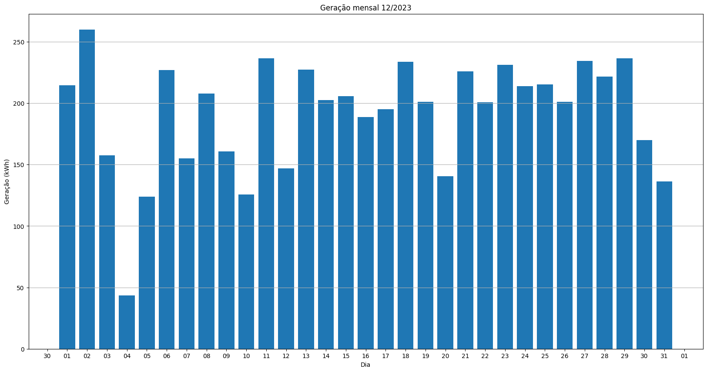

# Resumo
| Inversor | kWh    |
| -------- | ------ |
| S1_BL20_1       | 4707.10 |
| S1_BL20_2       | 46.50 |
| S1_BL11       | 181.60 |
| S1_BL8       | 4170.30 |
| S1_BL15       | 4660.50 |
| S1_BL5       | 3905.80 |
| S1_BL7       | 4126.40 |
| S1_BL55       | 2578.80 |
| S1_BL18_1       | 8169.30 |
| S1_BL18_2       | 3647.90 |
| S1_BL19       | 7904.60 |
| S1_BL13_1       | 5559.80 |
| S1_BL14       | 5941.20 |
| kWh_total       | 55599.80 |
# Geração Mensal por Inversor
## S1_BL20_1

## S1_BL20_2

## S1_BL11

## S1_BL8

## S1_BL15

## S1_BL5

## S1_BL7

## S1_BL55

## S1_BL18_1

## S1_BL18_2

## S1_BL19

## S1_BL13_1

## S1_BL14

