# Resumo
| Inversor | kWh    |
| -------- | ------ |
| S1_BL20_1       | 7576.10 |
| S1_BL20_2       | 61.60 |
| S1_BL11       | 4549.40 |
| S1_BL8       | 6660.10 |
| S1_BL15       | 7167.00 |
| S1_BL5       | 5529.90 |
| S1_BL7       | 6566.20 |
| S1_BL55       | 3931.80 |
| S1_BL18_1       | 8292.00 |
| S1_BL18_2       | 3670.90 |
| S1_BL19       | 8002.00 |
| S1_BL13_1       | 5777.50 |
| S1_BL14       | 5874.40 |
| kWh_total       | 73658.90 |
# Geração Mensal por Inversor
## S1_BL20_1
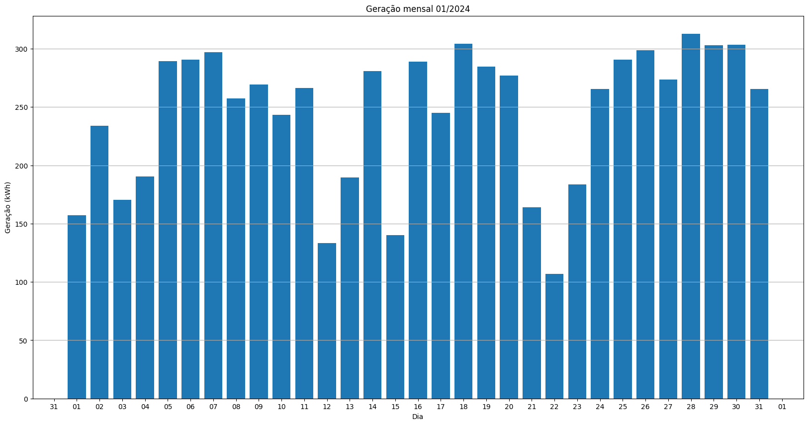
## S1_BL20_2
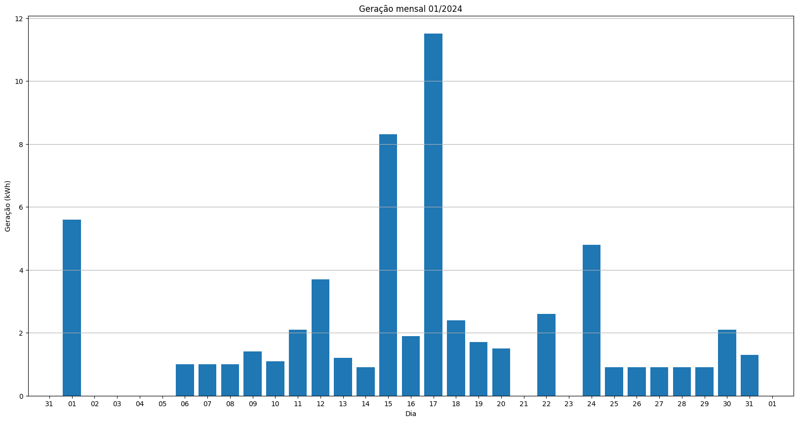
## S1_BL11
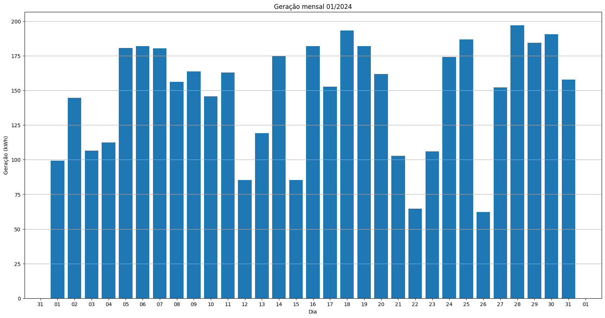
## S1_BL8

## S1_BL15
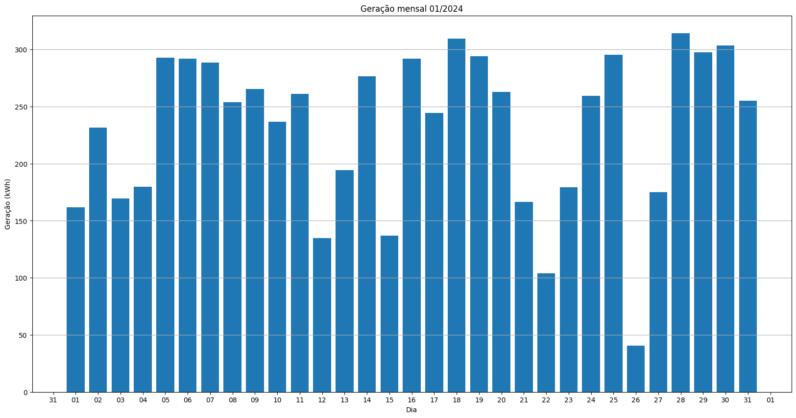
## S1_BL5
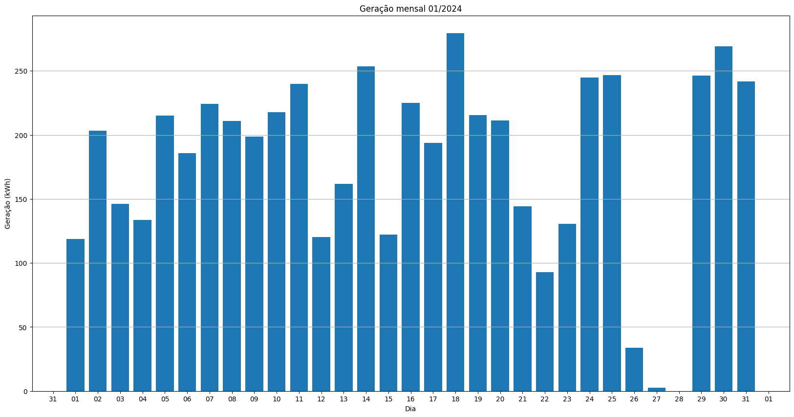
## S1_BL7
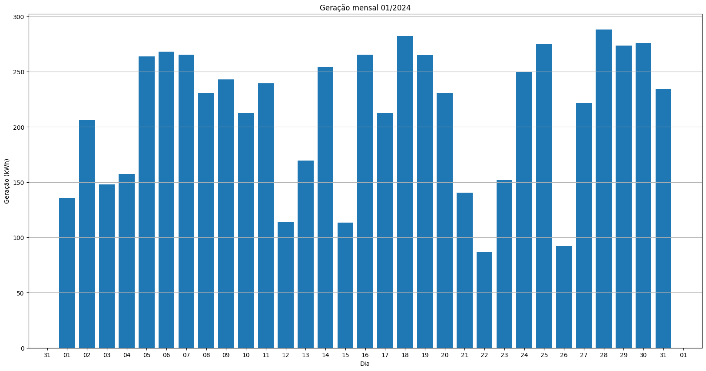
## S1_BL55
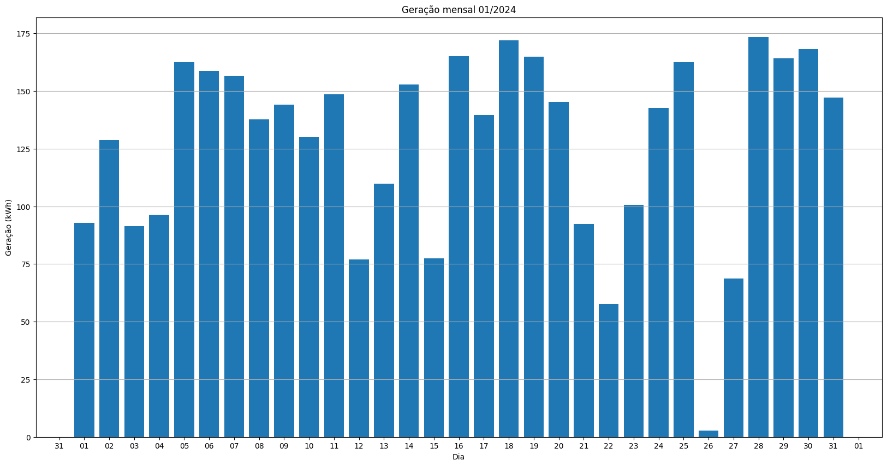
## S1_BL18_1

## S1_BL18_2
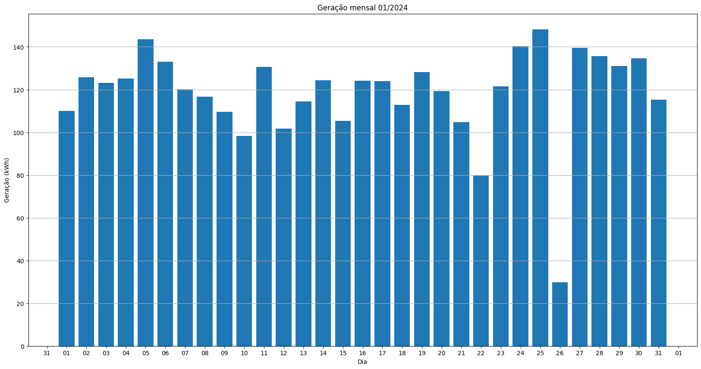
## S1_BL19
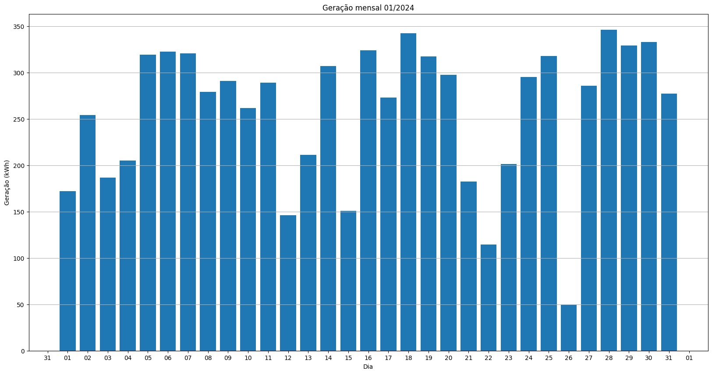
## S1_BL13_1
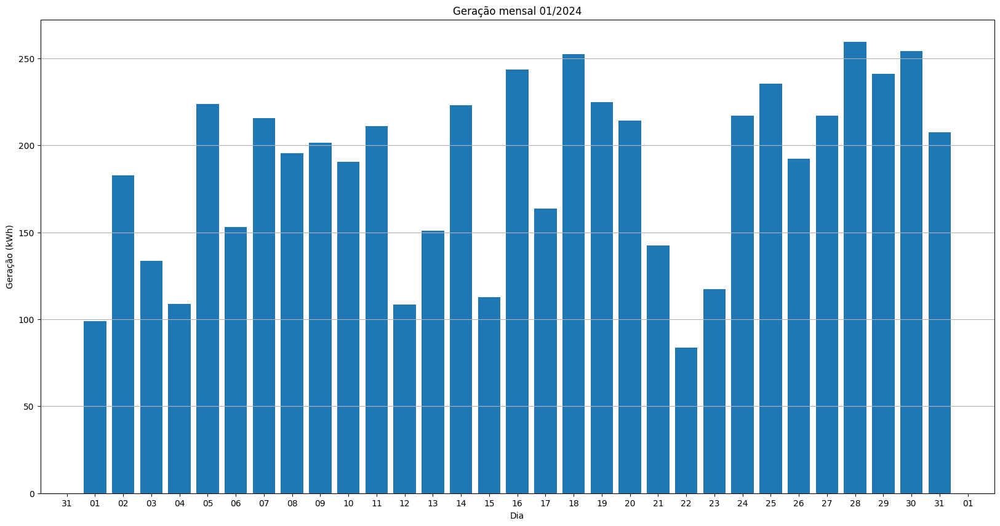
## S1_BL14
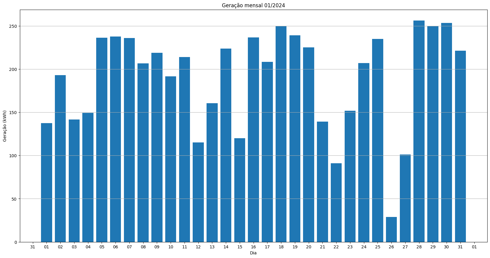
