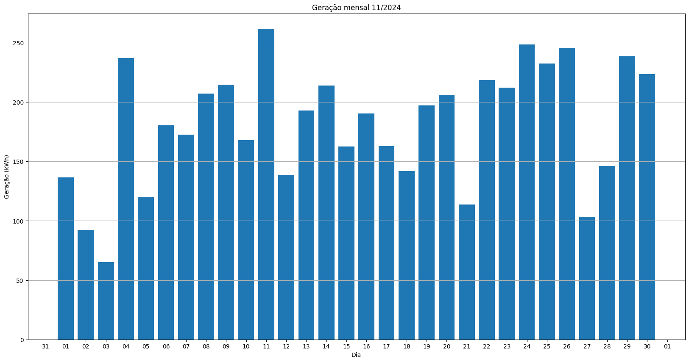
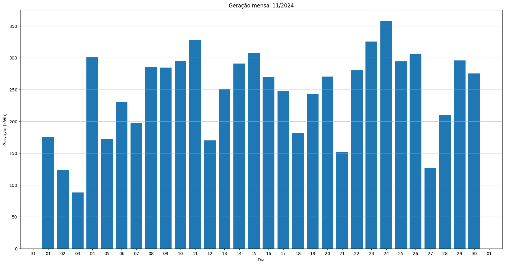

# Resumo
| Inversor | kWh    |
| -------- | ------ |
| S1_BL20_1       | 6499.00 |
| S1_BL20_2       | 6078.40 |
| S1_BL11       | 4070.60 |
| S1_BL8       | 5955.70 |
| S1_BL15       | 0.00 |
| S1_BL5       | 5443.80 |
| S1_BL7       | 6325.10 |
| S1_BL55       | 3538.00 |
| S1_BL18_1       | 7336.60 |
| S1_BL18_2       | 6970.50 |
| S1_BL19       | 7004.50 |
| S1_BL13_1       | 4939.00 |
| S1_BL13_2       | 2450.20 |
| S1_BL14       | 5470.70 |
| kWh_total       | 72082.10 |
# Geração Mensal por Inversor
## S1_BL20_1

## S1_BL20_2

## S1_BL11

## S1_BL8

## S1_BL15

## S1_BL5

## S1_BL7

## S1_BL55

## S1_BL18_1

## S1_BL18_2

## S1_BL19

## S1_BL13_1

## S1_BL13_2

## S1_BL14

