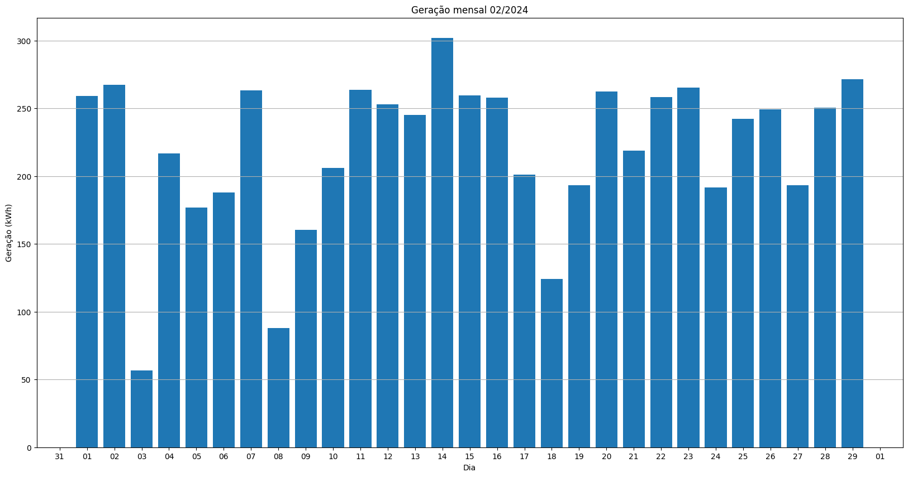

# Resumo
| Inversor | kWh    |
| -------- | ------ |
| S1_BL20_1       | 6588.30 |
| S1_BL20_2       | 62.60 |
| S1_BL11       | 3936.60 |
| S1_BL8       | 5846.10 |
| S1_BL15       | 6383.40 |
| S1_BL5       | 5112.70 |
| S1_BL7       | 5666.90 |
| S1_BL55       | 3563.20 |
| S1_BL18_1       | 7331.10 |
| S1_BL18_2       | 3318.50 |
| S1_BL19       | 7048.30 |
| S1_BL13_1       | 4827.60 |
| S1_BL13_2       | 697.20 |
| S1_BL14       | 5400.70 |
| kWh_total       | 65783.20 |
# Geração Mensal por Inversor
## S1_BL20_1

## S1_BL20_2

## S1_BL11

## S1_BL8

## S1_BL15

## S1_BL5

## S1_BL7

## S1_BL55

## S1_BL18_1

## S1_BL18_2

## S1_BL19

## S1_BL13_1

## S1_BL13_2

## S1_BL14

