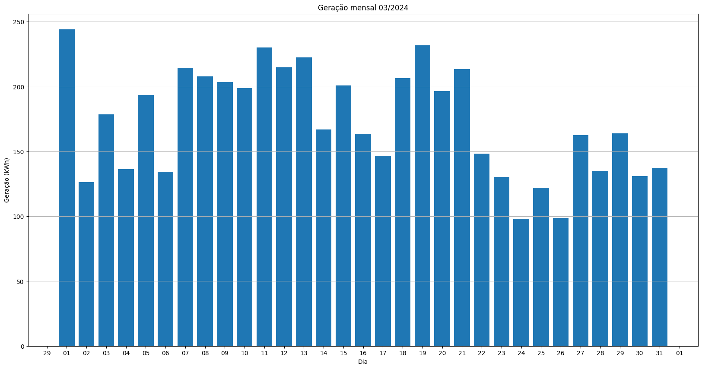

# Resumo
| Inversor | kWh    |
| -------- | ------ |
| S1_BL20_1       | 6712.40 |
| S1_BL20_2       | 66.60 |
| S1_BL11       | 4034.90 |
| S1_BL8       | 5856.70 |
| S1_BL15       | 6452.90 |
| S1_BL5       | 5359.10 |
| S1_BL7       | 5511.20 |
| S1_BL55       | 3866.40 |
| S1_BL18_1       | 7397.30 |
| S1_BL18_2       | 3497.40 |
| S1_BL19       | 7089.80 |
| S1_BL13_1       | 5203.10 |
| S1_BL13_2       | 2950.00 |
| S1_BL14       | 5578.00 |
| kWh_total       | 69575.80 |
# Geração Mensal por Inversor
## S1_BL20_1

## S1_BL20_2

## S1_BL11

## S1_BL8

## S1_BL15

## S1_BL5

## S1_BL7

## S1_BL55

## S1_BL18_1

## S1_BL18_2

## S1_BL19

## S1_BL13_1

## S1_BL13_2

## S1_BL14

