# Resumo
| Inversor | kWh    |
| -------- | ------ |
| S1_BL20_1       | 5776.30 |
| S1_BL20_2       | 47.90 |
| S1_BL11       | 3444.70 |
| S1_BL8       | 5000.80 |
| S1_BL15       | 5250.60 |
| S1_BL5       | 4187.20 |
| S1_BL7       | 4135.80 |
| S1_BL55       | 3370.80 |
| S1_BL18_1       | 6027.50 |
| S1_BL18_2       | 3187.90 |
| S1_BL19       | 5772.40 |
| S1_BL13_1       | 4488.50 |
| S1_BL13_2       | 2530.00 |
| S1_BL14       | 4701.30 |
| kWh_total       | 57921.70 |
# Geração Mensal por Inversor
## S1_BL20_1
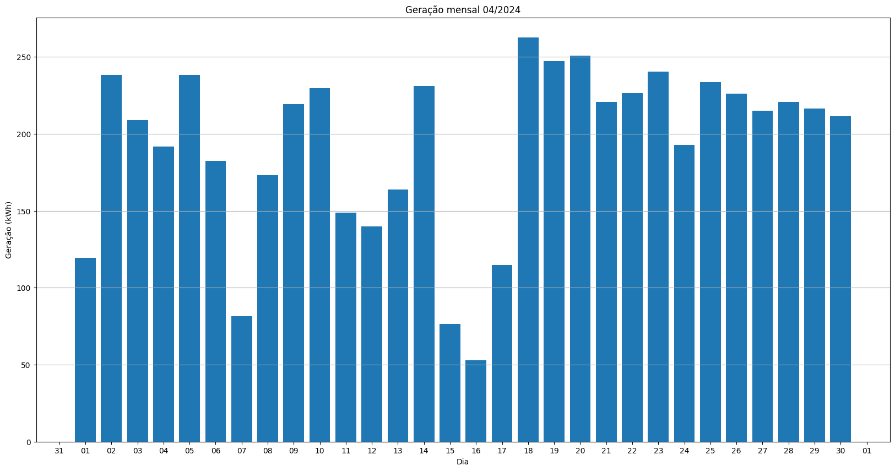
## S1_BL20_2
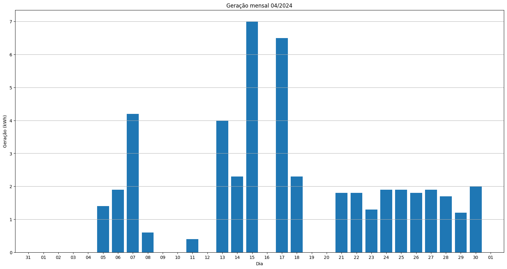
## S1_BL11
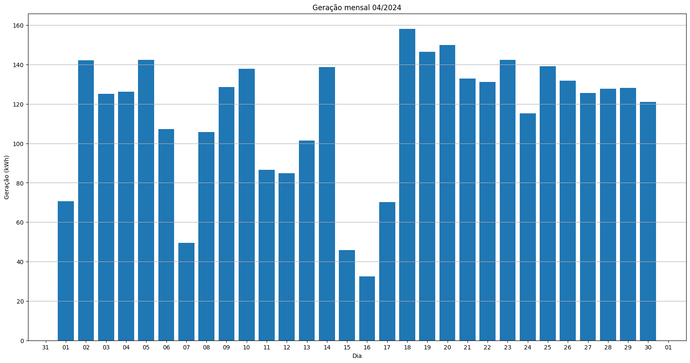
## S1_BL8
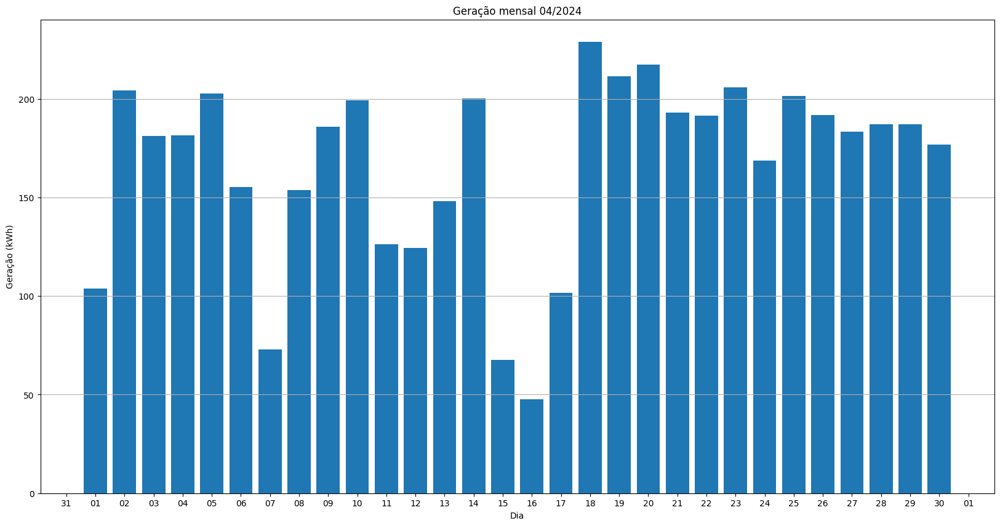
## S1_BL15
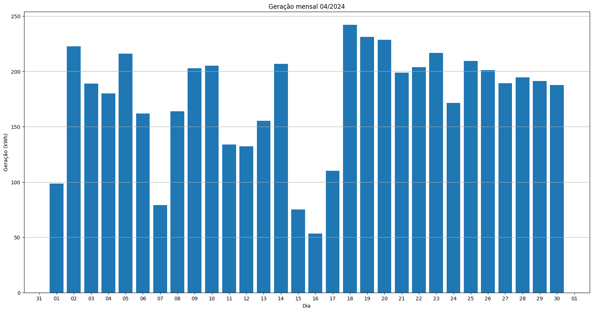
## S1_BL5
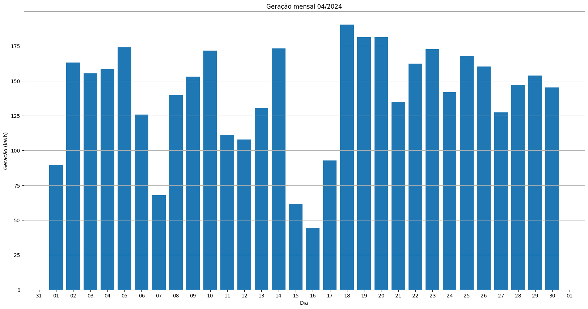
## S1_BL7
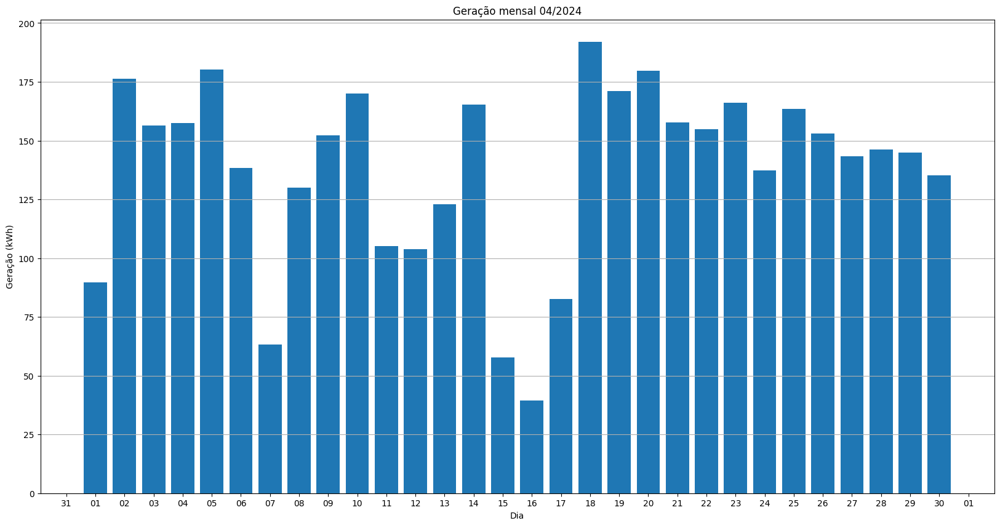
## S1_BL55

## S1_BL18_1
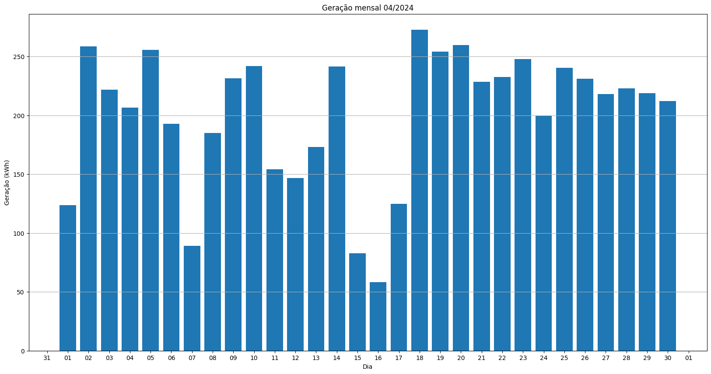
## S1_BL18_2
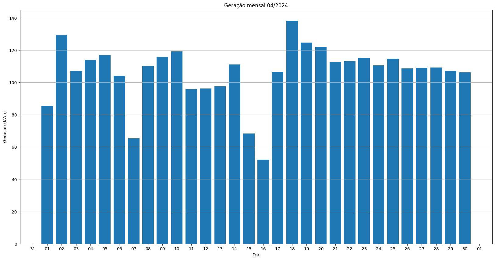
## S1_BL19
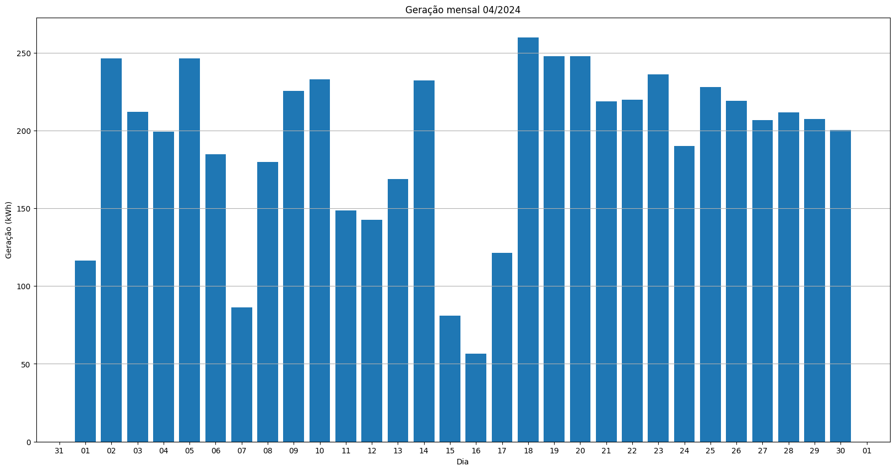
## S1_BL13_1
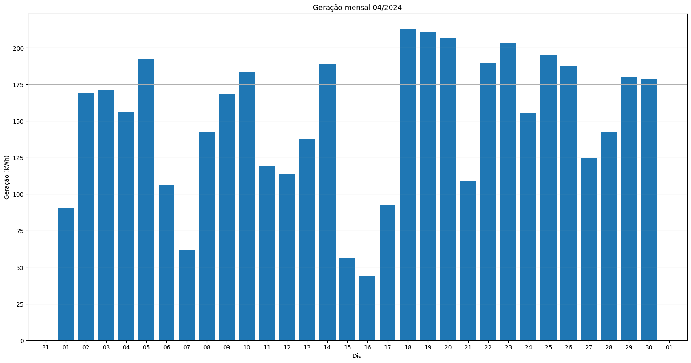
## S1_BL13_2
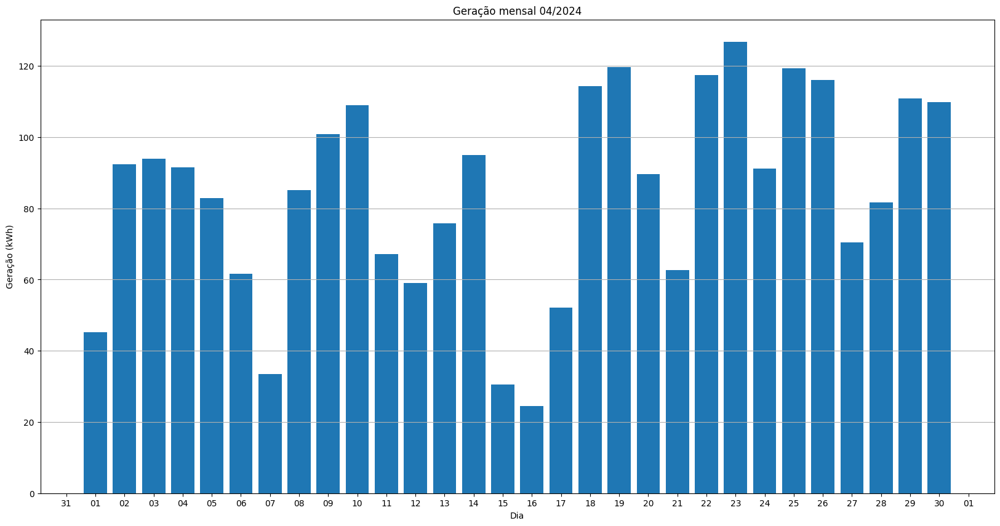
## S1_BL14
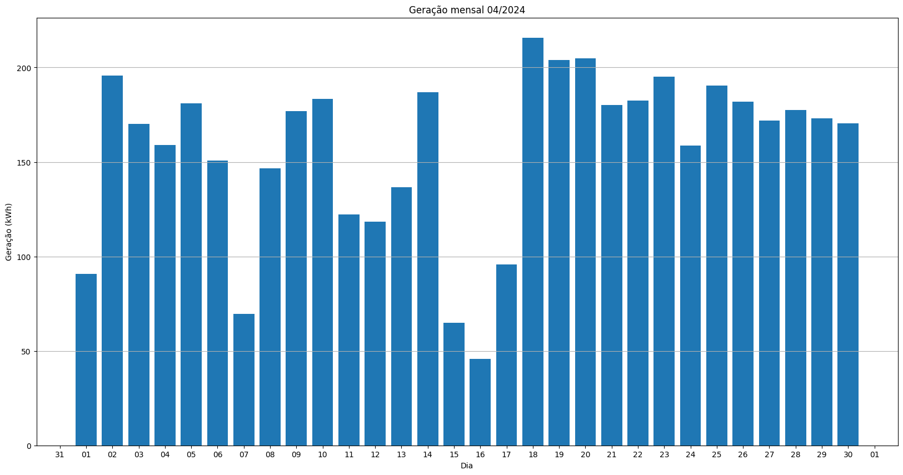
