# Resumo
| Inversor | kWh    |
| -------- | ------ |
| S1_BL20_1       | 5088.20 |
| S1_BL20_2       | 137.20 |
| S1_BL11       | 2975.60 |
| S1_BL8       | 4354.40 |
| S1_BL15       | 4496.70 |
| S1_BL5       | 3563.80 |
| S1_BL7       | 3178.20 |
| S1_BL55       | 3090.20 |
| S1_BL18_1       | 5103.10 |
| S1_BL18_2       | 3007.10 |
| S1_BL19       | 4837.20 |
| S1_BL13_1       | 4142.80 |
| S1_BL13_2       | 2410.10 |
| S1_BL14       | 4071.20 |
| kWh_total       | 50455.80 |
# Geração Mensal por Inversor
## S1_BL20_1
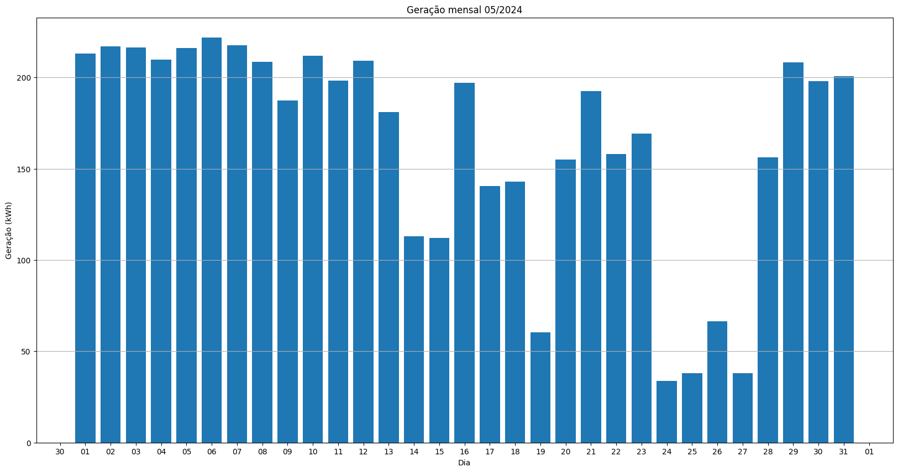
## S1_BL20_2
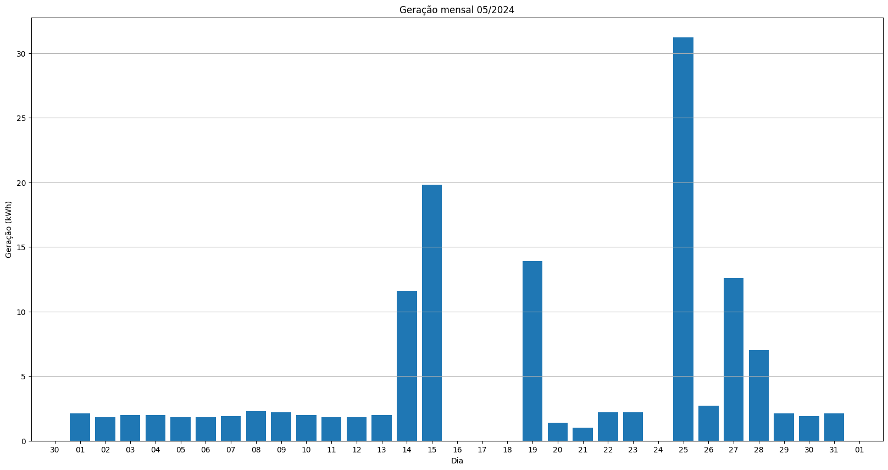
## S1_BL11

## S1_BL8

## S1_BL15
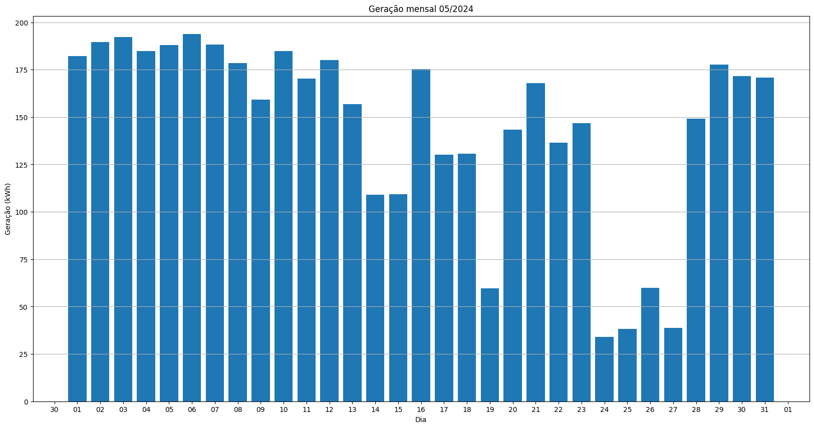
## S1_BL5
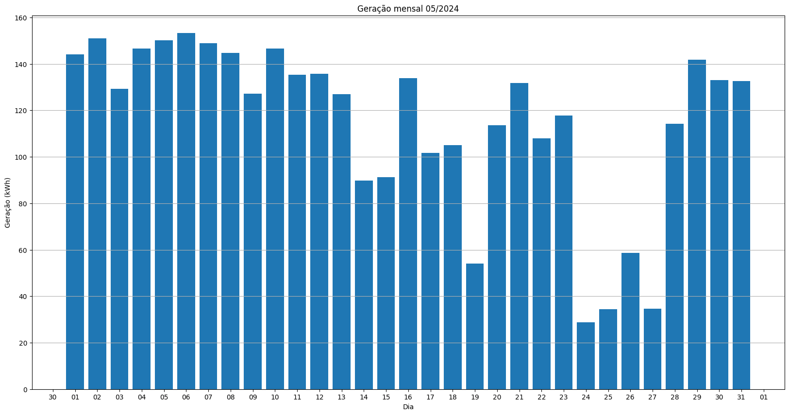
## S1_BL7
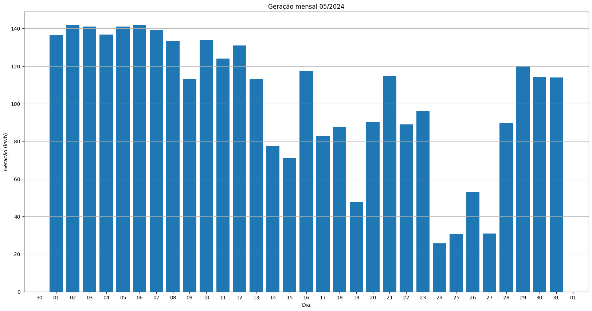
## S1_BL55
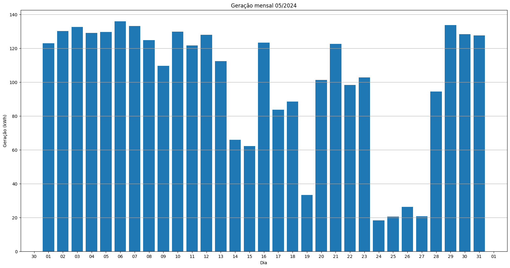
## S1_BL18_1
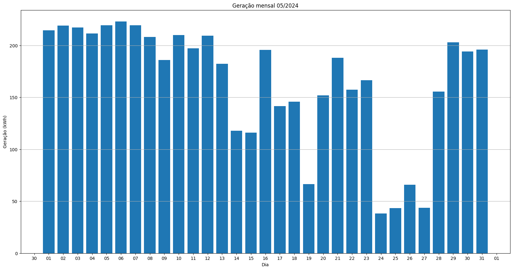
## S1_BL18_2
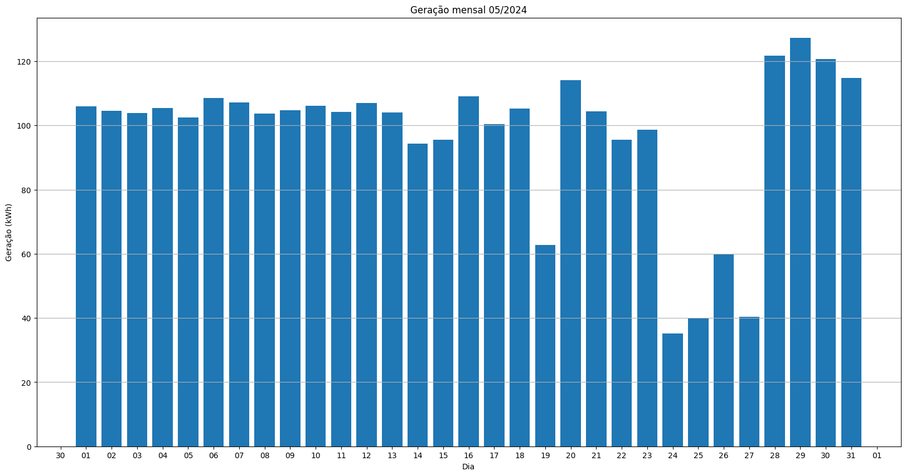
## S1_BL19
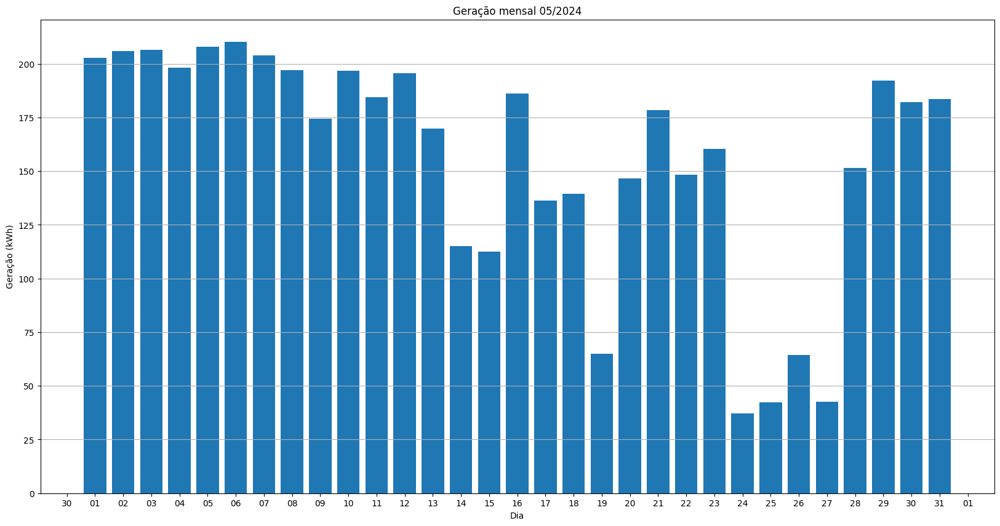
## S1_BL13_1
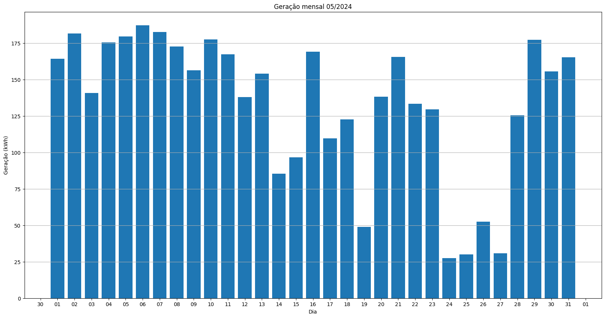
## S1_BL13_2
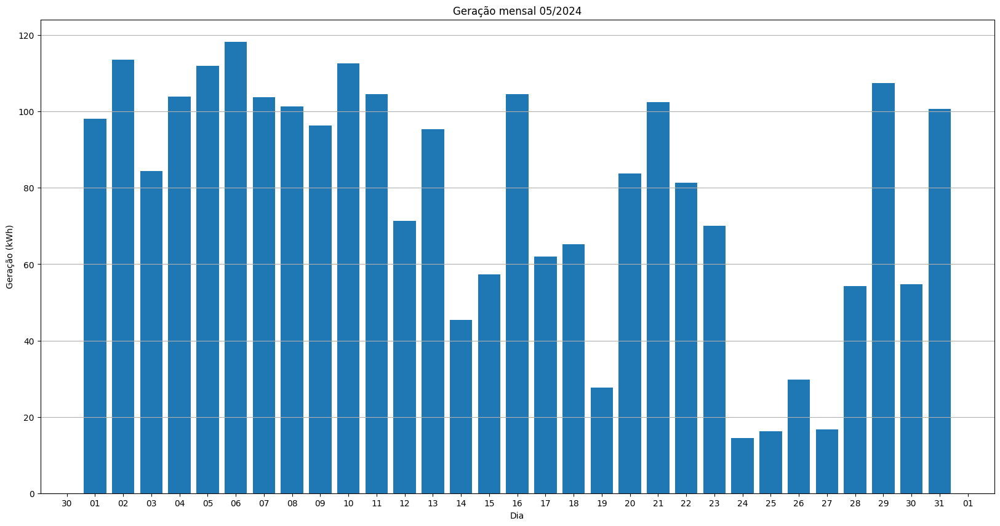
## S1_BL14

