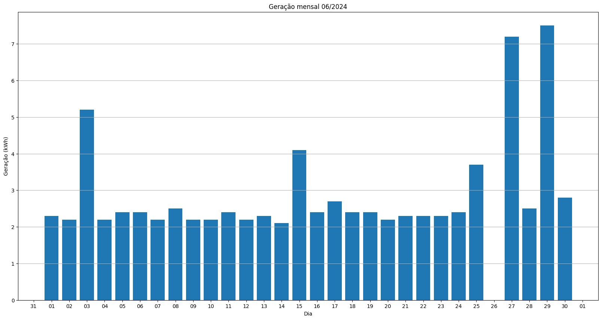
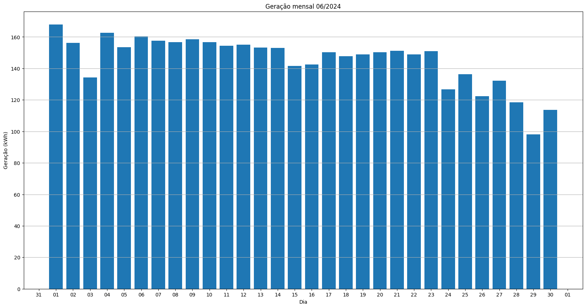
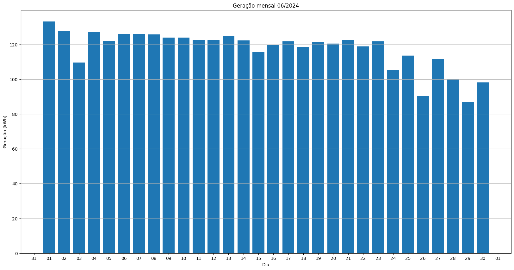
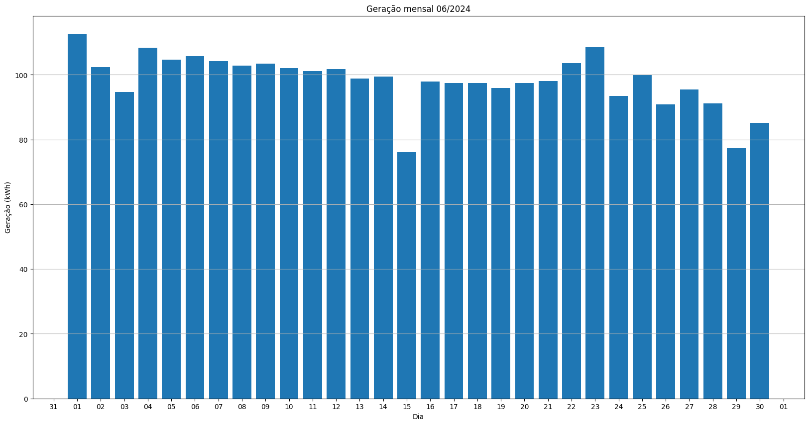
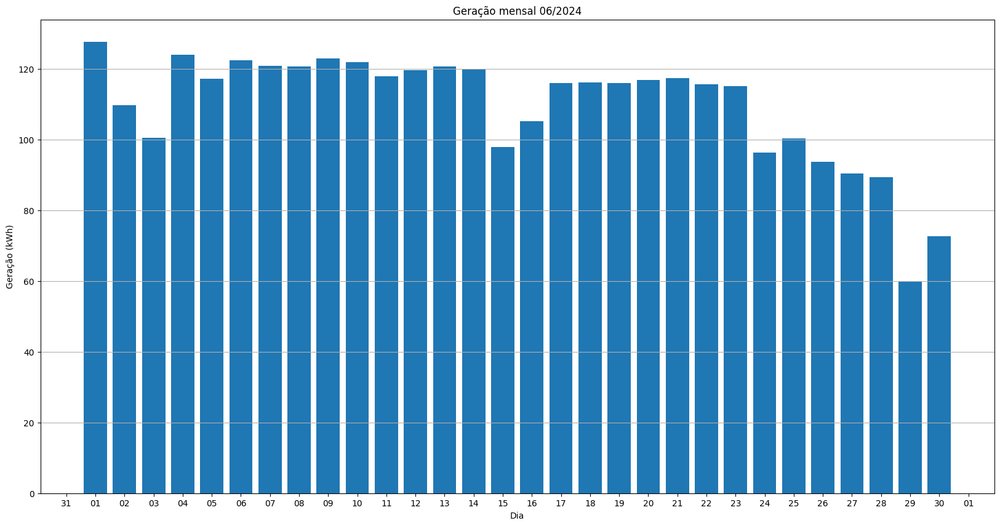
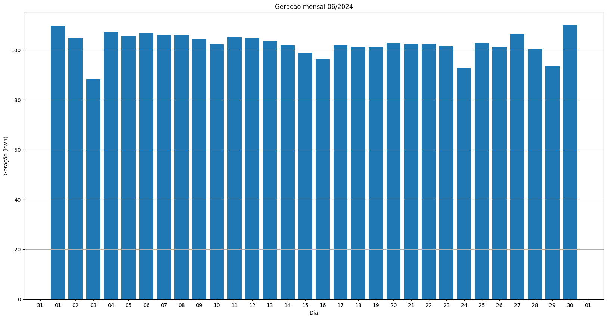
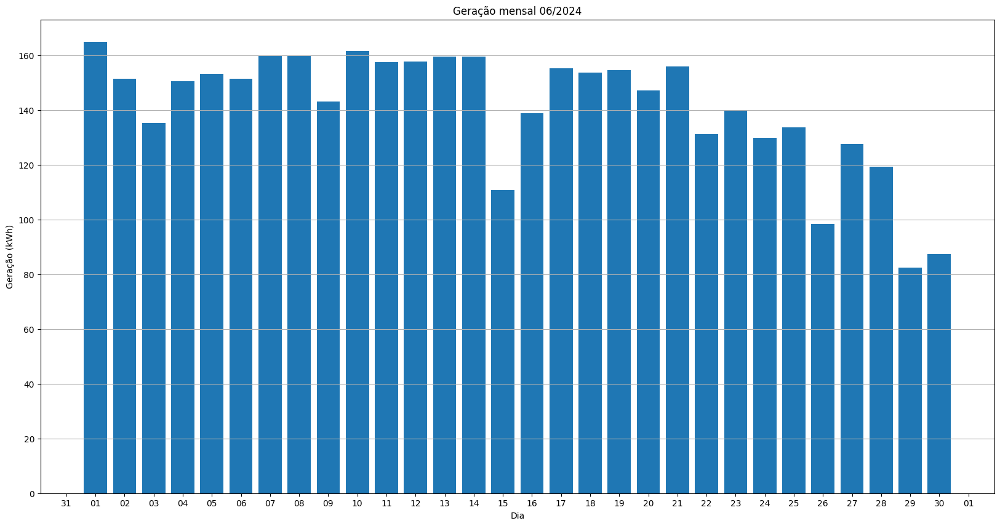
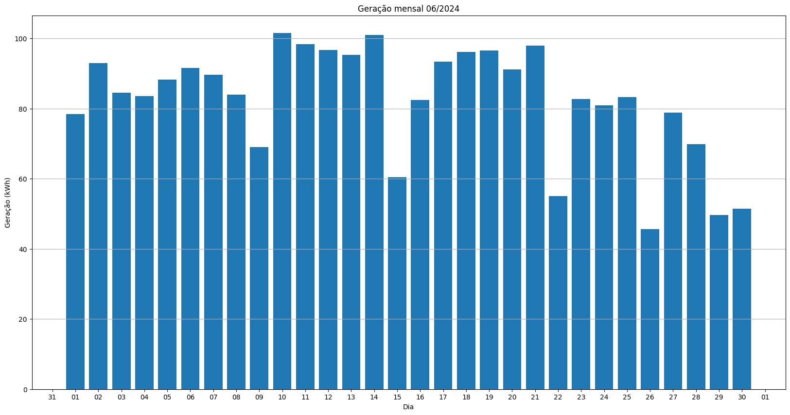
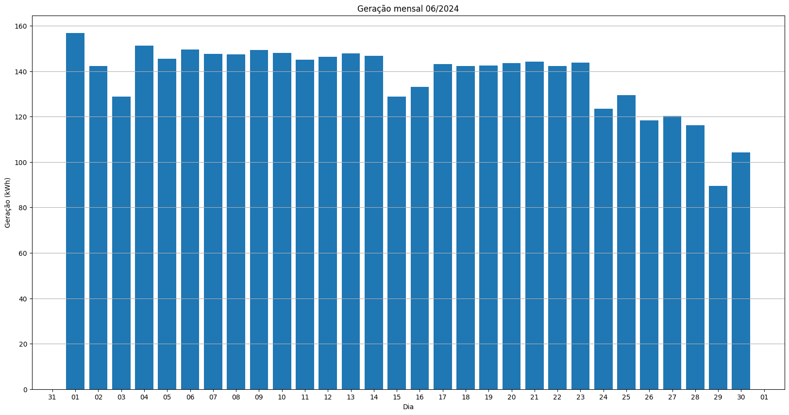

# Resumo
| Inversor | kWh    |
| -------- | ------ |
| S1_BL20_1       | 5197.30 |
| S1_BL20_2       | 84.00 |
| S1_BL11       | 3047.50 |
| S1_BL8       | 4406.60 |
| S1_BL15       | 4360.20 |
| S1_BL5       | 3524.20 |
| S1_BL7       | 2947.90 |
| S1_BL55       | 3282.90 |
| S1_BL18_1       | 5012.60 |
| S1_BL18_2       | 3072.20 |
| S1_BL19       | 4762.20 |
| S1_BL13_1       | 4232.30 |
| S1_BL13_2       | 2470.80 |
| S1_BL14       | 4116.80 |
| kWh_total       | 50517.50 |
# Geração Mensal por Inversor
## S1_BL20_1

## S1_BL20_2

## S1_BL11

## S1_BL8

## S1_BL15

## S1_BL5

## S1_BL7

## S1_BL55

## S1_BL18_1

## S1_BL18_2

## S1_BL19

## S1_BL13_1

## S1_BL13_2

## S1_BL14

