# Resumo
| Inversor | kWh    |
| -------- | ------ |
| S1_BL20_1       | 4681.40 |
| S1_BL20_2       | 88.10 |
| S1_BL11       | 2815.70 |
| S1_BL8       | 3517.60 |
| S1_BL15       | 4153.20 |
| S1_BL5       | 2926.60 |
| S1_BL7       | 2653.60 |
| S1_BL55       | 3163.20 |
| S1_BL18_1       | 4761.90 |
| S1_BL18_2       | 3077.50 |
| S1_BL19       | 4534.50 |
| S1_BL13_1       | 3878.50 |
| S1_BL13_2       | 2181.80 |
| S1_BL14       | 3974.70 |
| kWh_total       | 46408.30 |
# Geração Mensal por Inversor
## S1_BL20_1
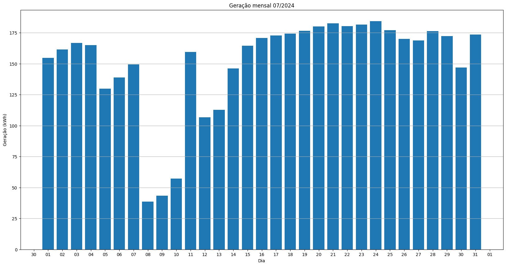
## S1_BL20_2
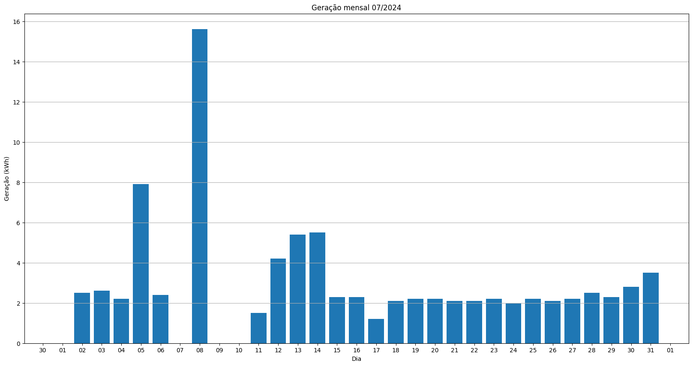
## S1_BL11
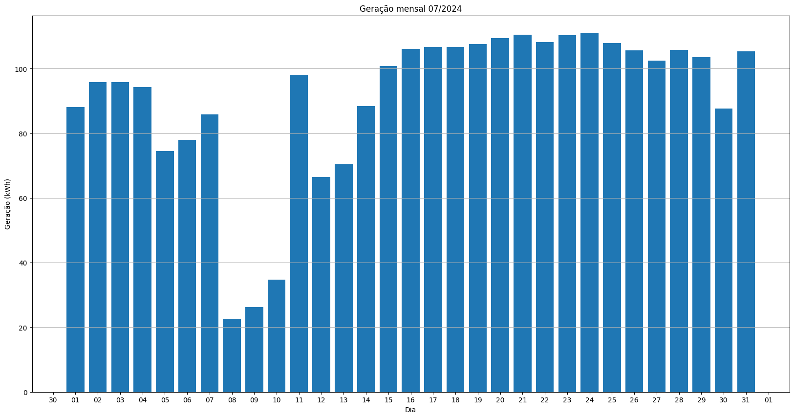
## S1_BL8
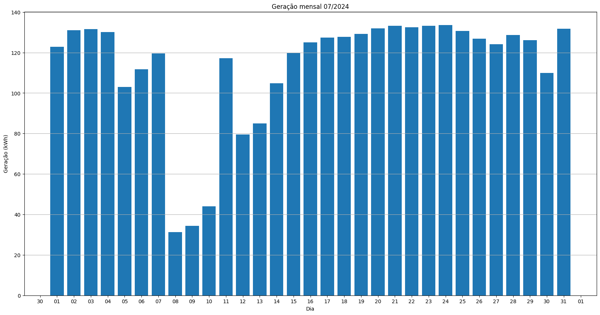
## S1_BL15
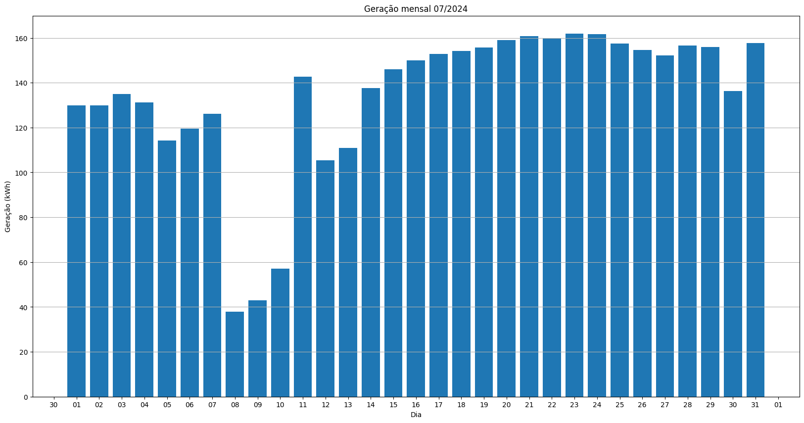
## S1_BL5
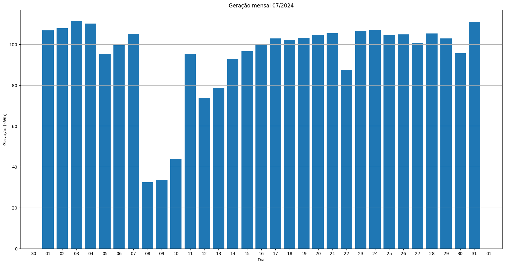
## S1_BL7
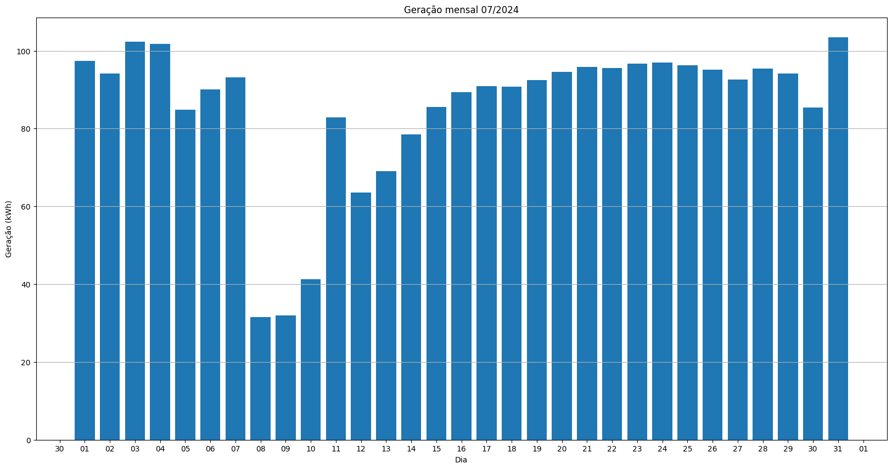
## S1_BL55
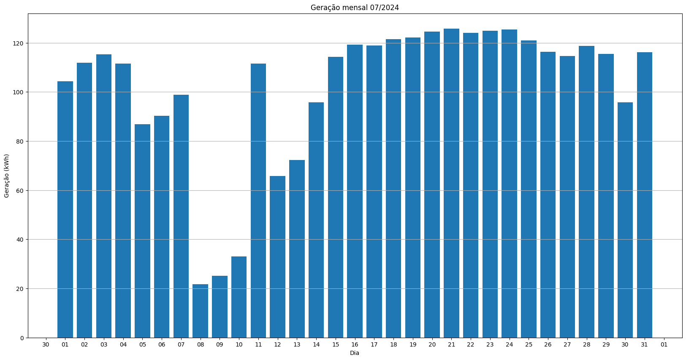
## S1_BL18_1
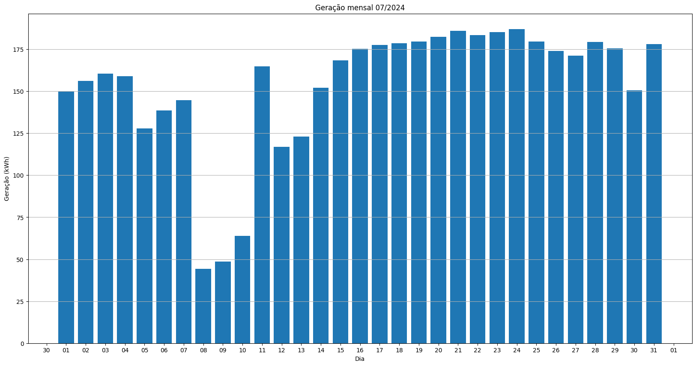
## S1_BL18_2
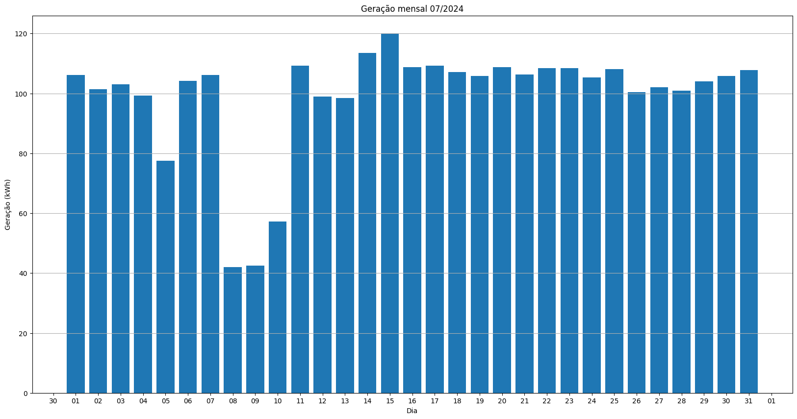
## S1_BL19
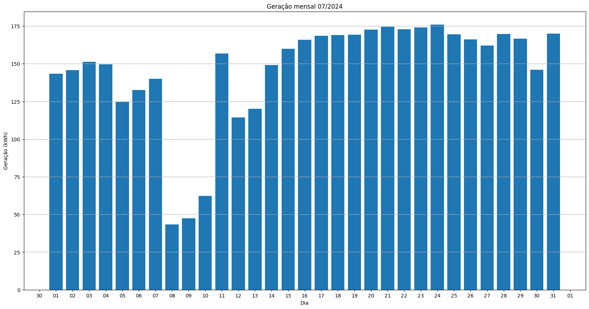
## S1_BL13_1
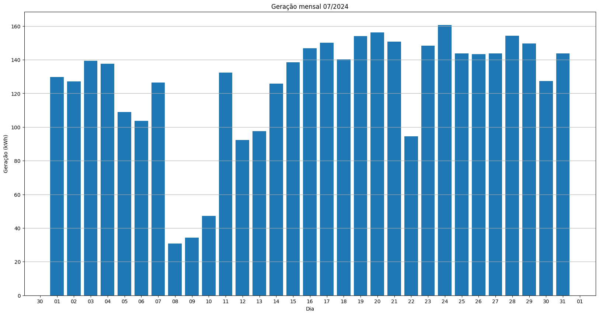
## S1_BL13_2
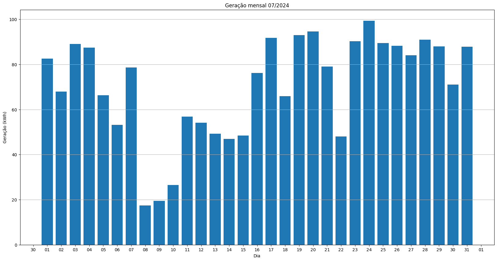
## S1_BL14
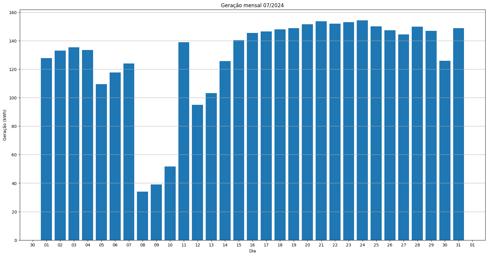
