# Resumo
| Inversor | kWh    |
| -------- | ------ |
| S1_BL20_1       | 5661.30 |
| S1_BL20_2       | 103.00 |
| S1_BL11       | 3278.80 |
| S1_BL8       | 4494.80 |
| S1_BL15       | 5179.70 |
| S1_BL5       | 3810.50 |
| S1_BL7       | 3922.90 |
| S1_BL55       | 3520.50 |
| S1_BL18_1       | 5861.20 |
| S1_BL18_2       | 5087.50 |
| S1_BL19       | 5604.70 |
| S1_BL13_1       | 4613.10 |
| S1_BL13_2       | 2480.50 |
| S1_BL14       | 4737.80 |
| kWh_total       | 58356.30 |
# Geração Mensal por Inversor
## S1_BL20_1
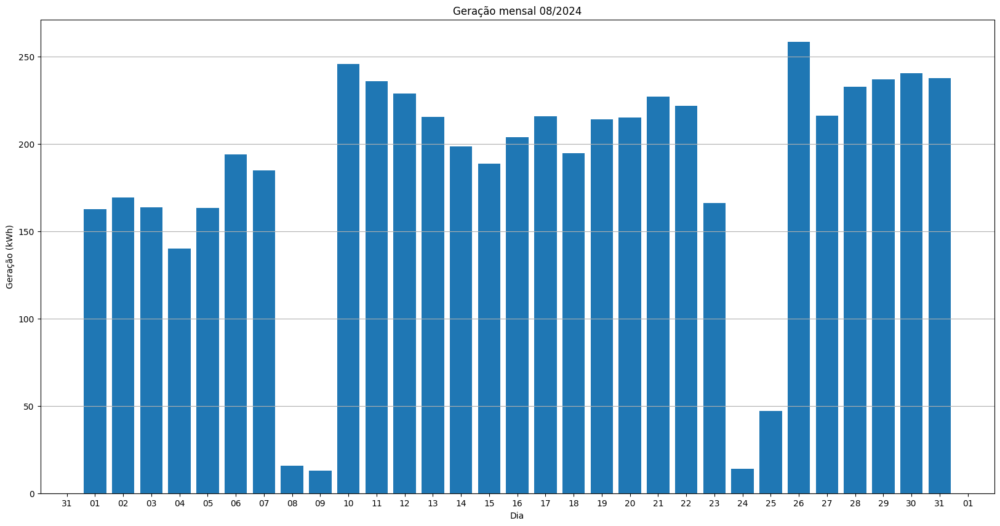
## S1_BL20_2
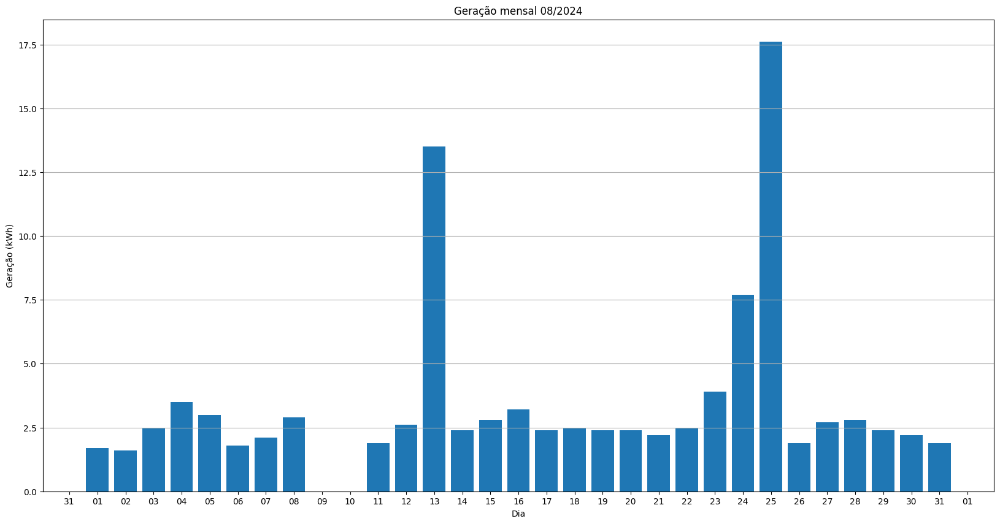
## S1_BL11
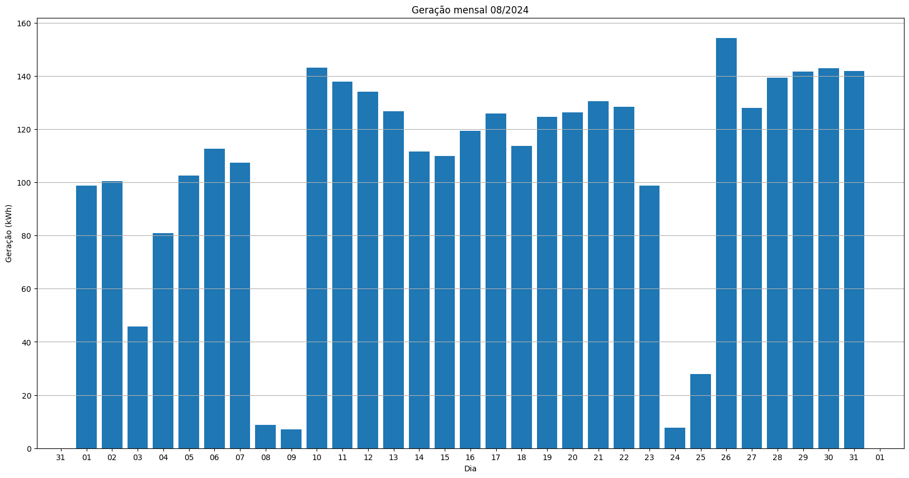
## S1_BL8
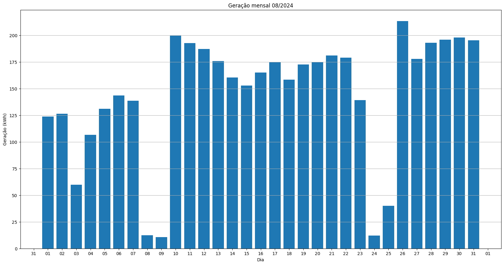
## S1_BL15
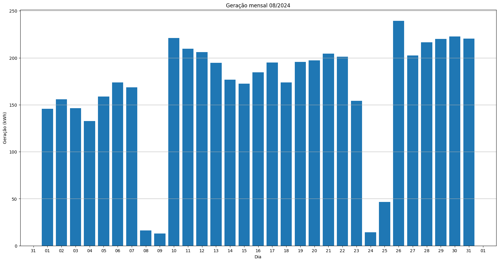
## S1_BL5
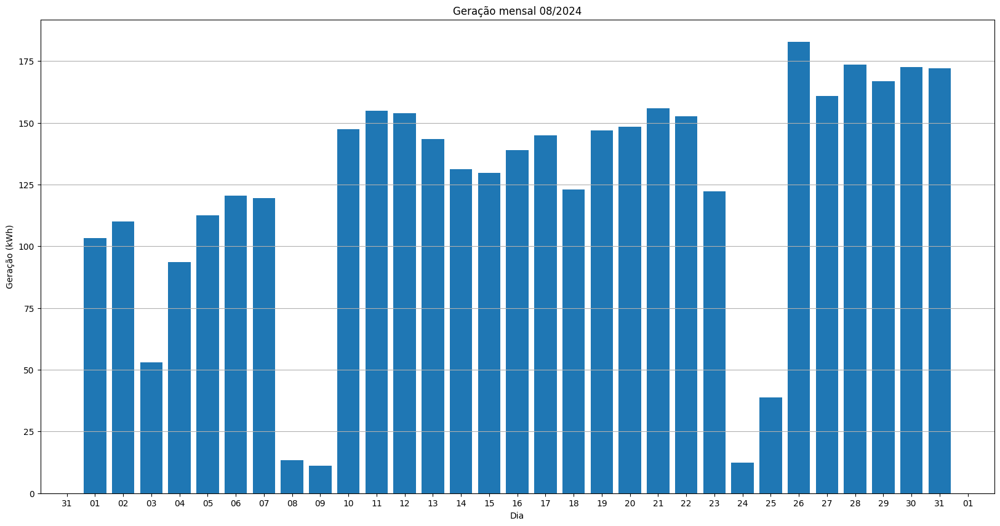
## S1_BL7
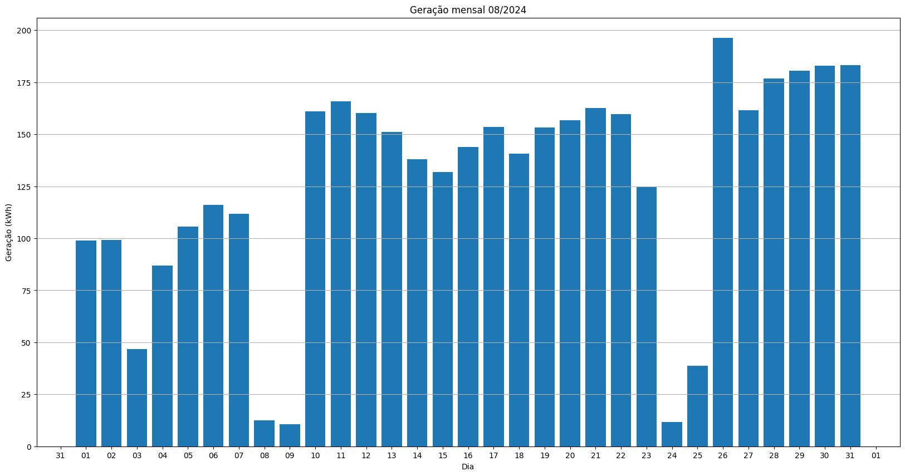
## S1_BL55
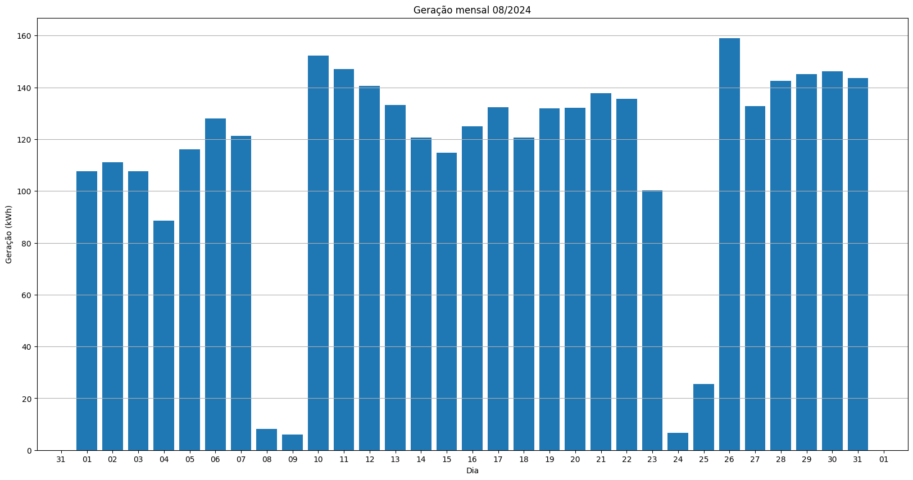
## S1_BL18_1
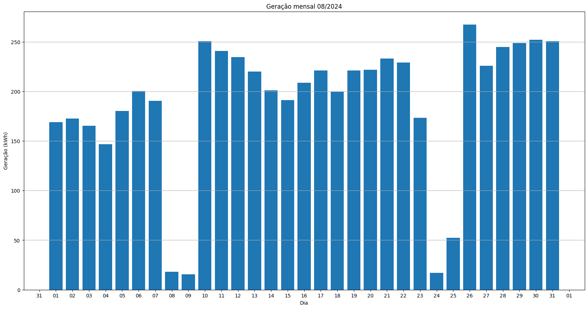
## S1_BL18_2
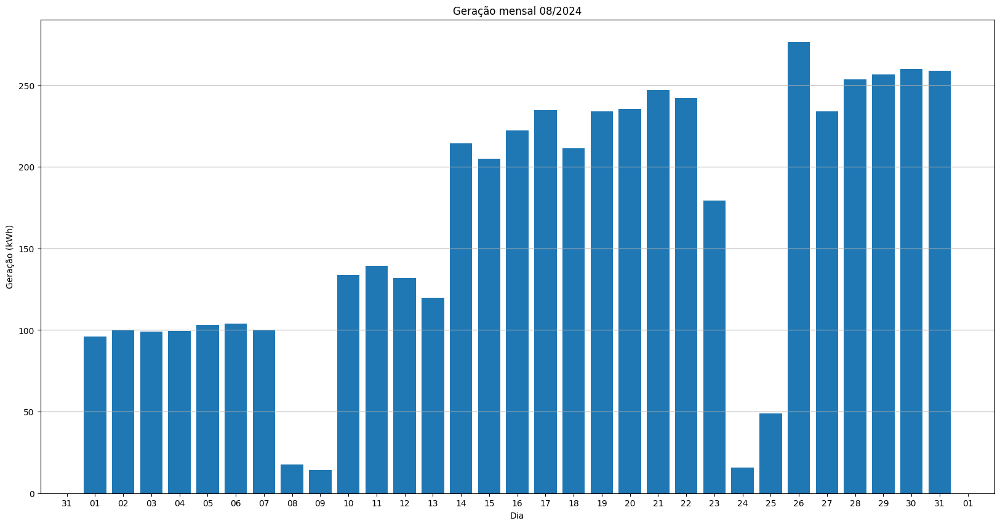
## S1_BL19
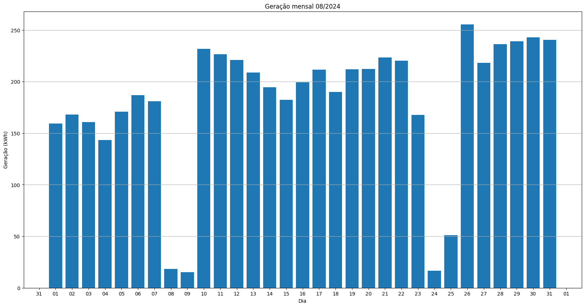
## S1_BL13_1
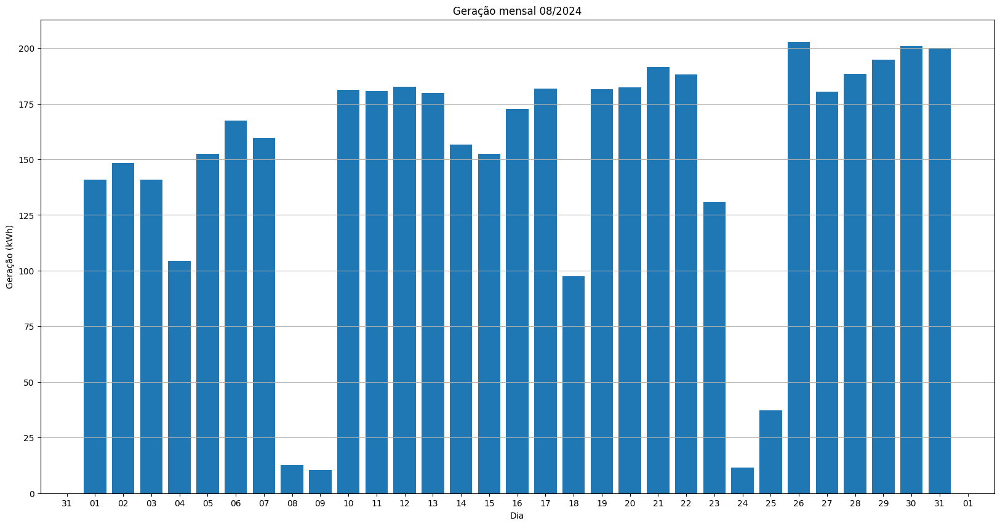
## S1_BL13_2
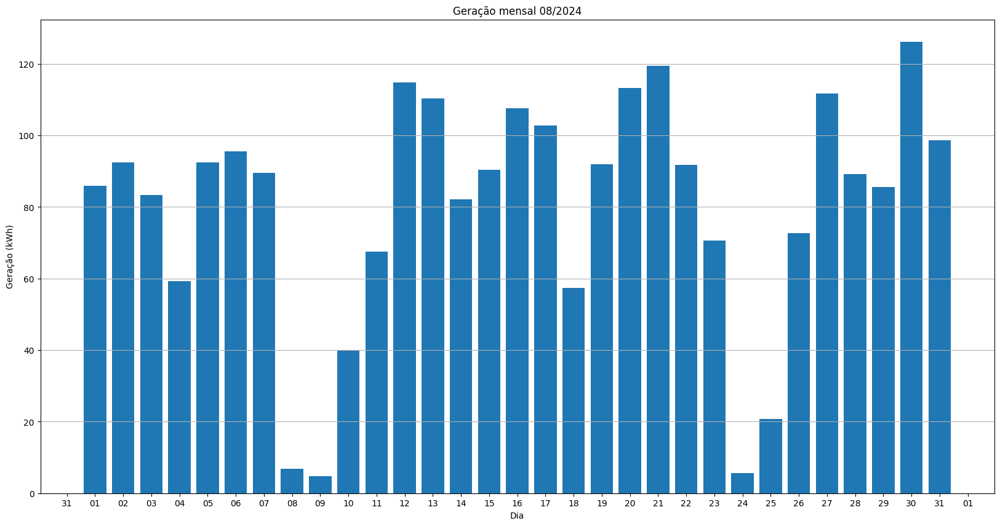
## S1_BL14
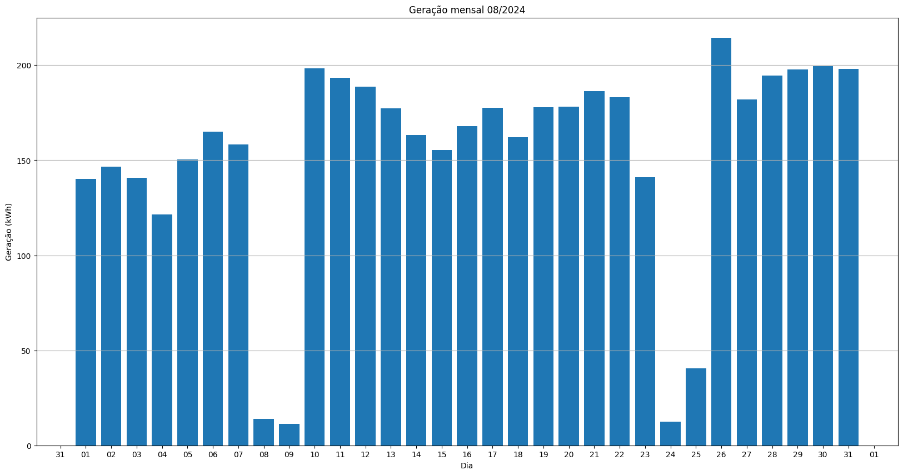
