# Resumo
| Inversor | kWh    |
| -------- | ------ |
| S1_BL20_1       | 7339.80 |
| S1_BL20_2       | 6910.20 |
| S1_BL11       | 4633.80 |
| S1_BL8       | 6800.50 |
| S1_BL15       | 0.00 |
| S1_BL5       | 6377.40 |
| S1_BL7       | 7248.20 |
| S1_BL55       | 4014.40 |
| S1_BL18_1       | 2026.90 |
| S1_BL18_2       | 7814.30 |
| S1_BL19       | 0.00 |
| S1_BL13_1       | 5842.70 |
| S1_BL13_2       | 2923.40 |
| S1_BL14       | 6192.80 |
| kWh_total       | 68124.40 |
# Geração Mensal por Inversor
## S1_BL20_1
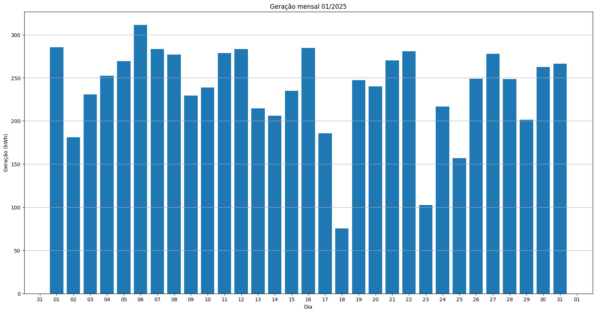
## S1_BL20_2
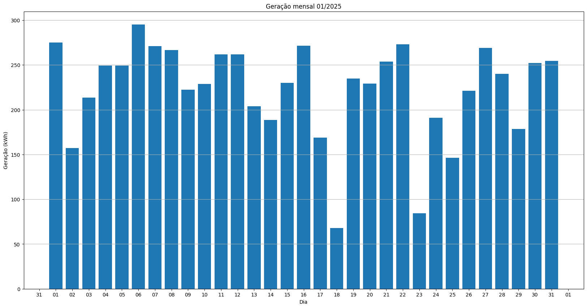
## S1_BL11
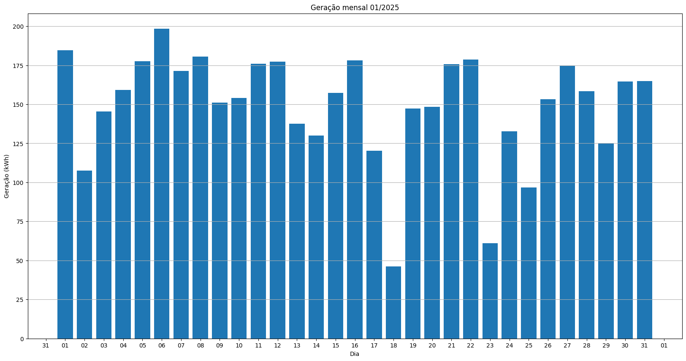
## S1_BL8

## S1_BL15

## S1_BL5
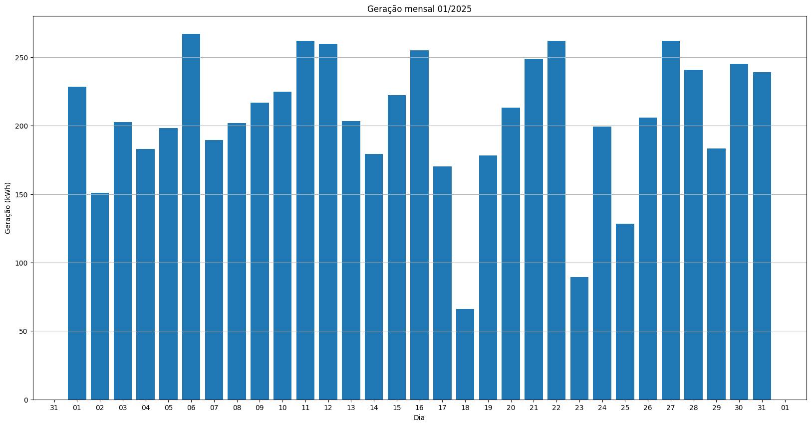
## S1_BL7
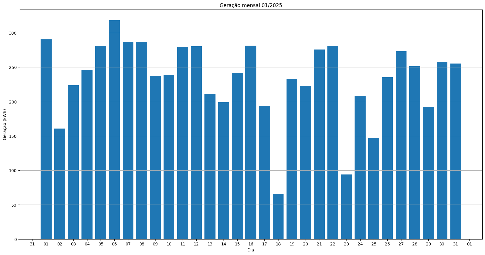
## S1_BL55
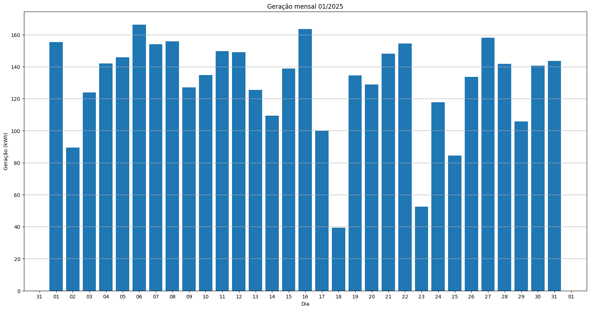
## S1_BL18_1
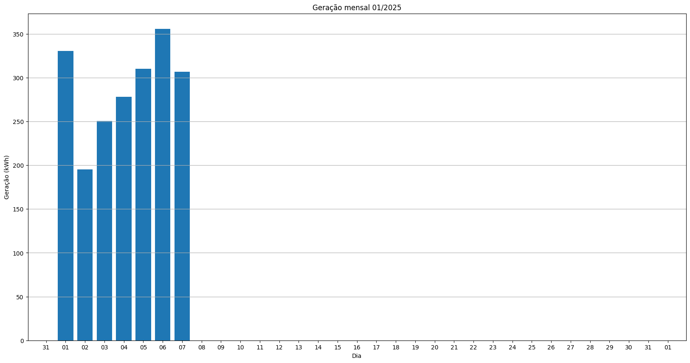
## S1_BL18_2
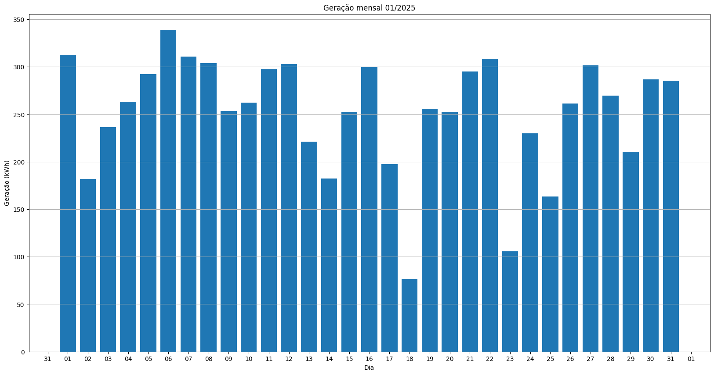
## S1_BL19
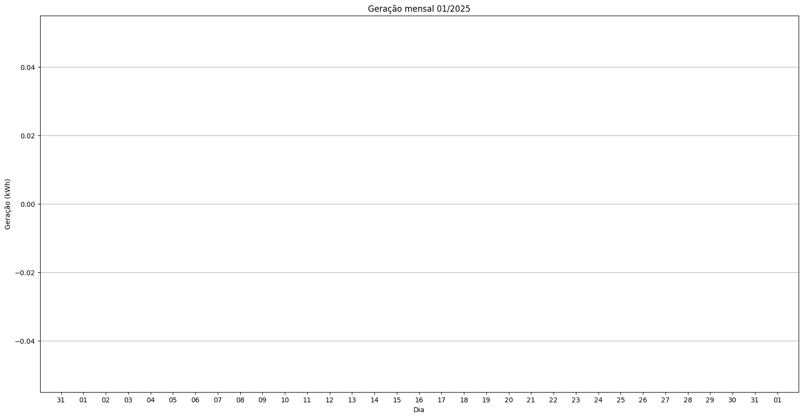
## S1_BL13_1
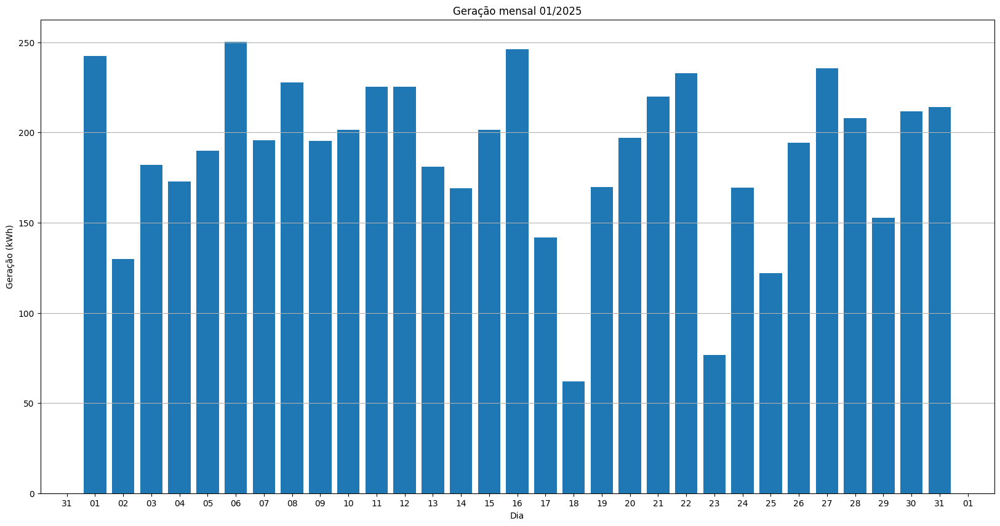
## S1_BL13_2
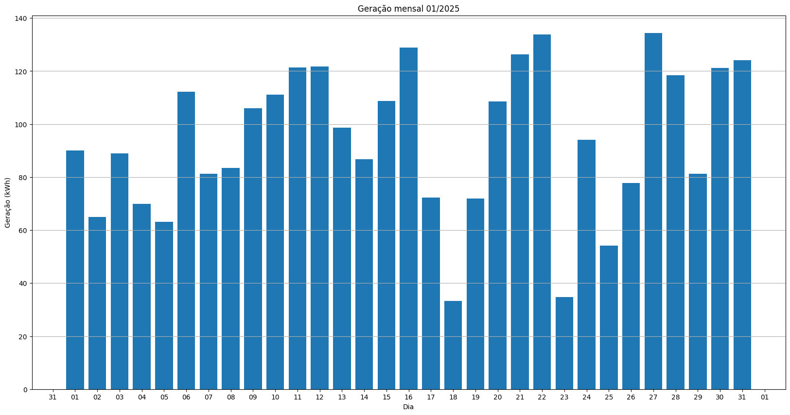
## S1_BL14
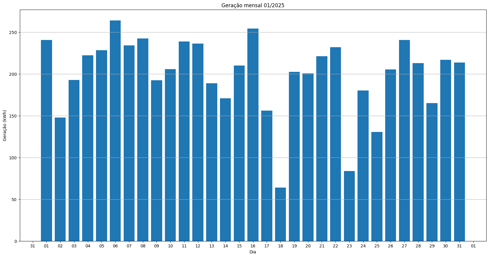
