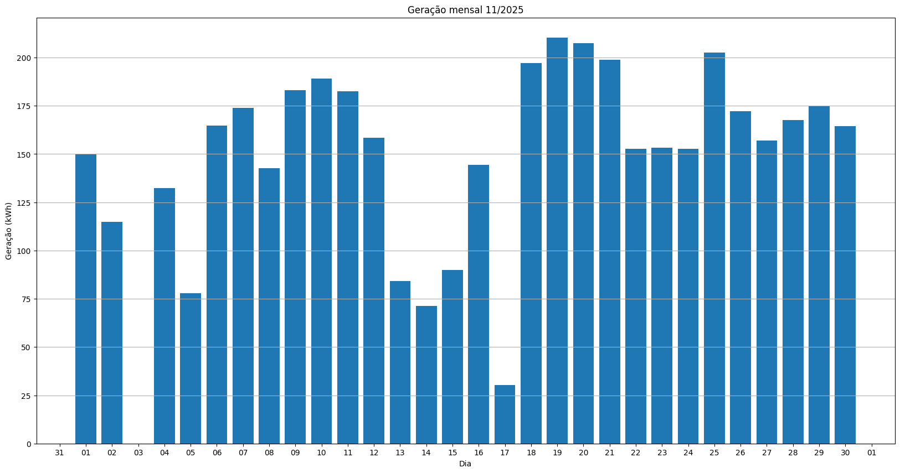
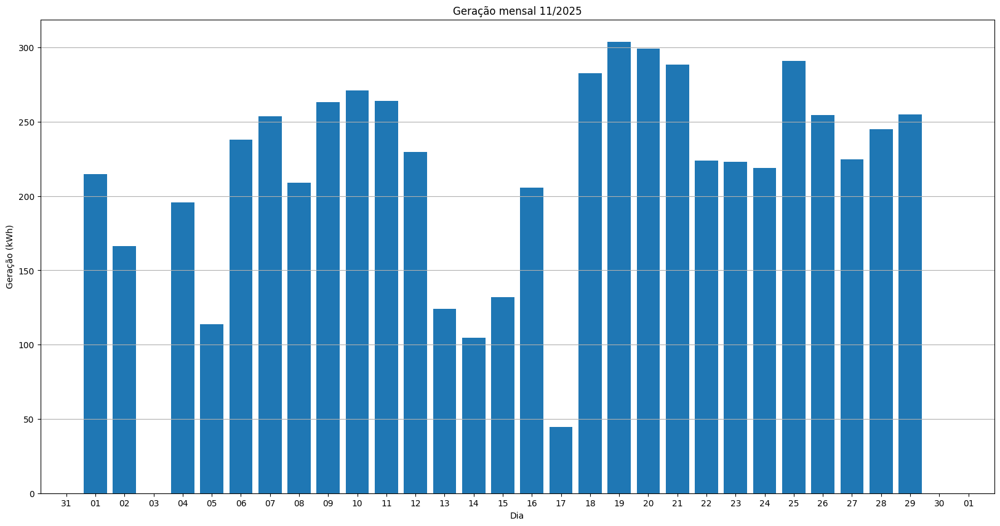
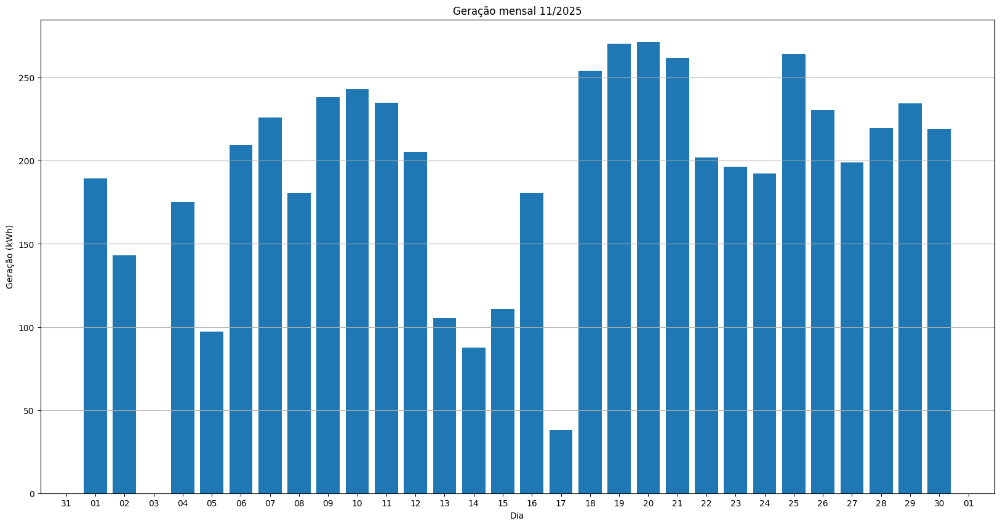
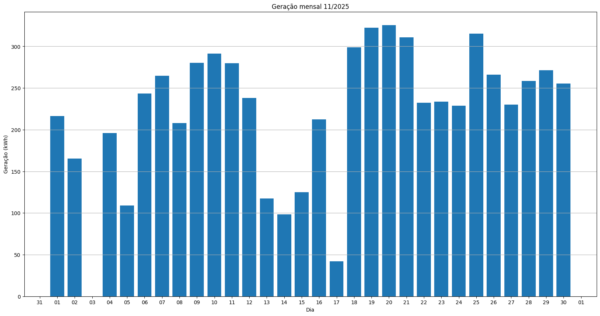
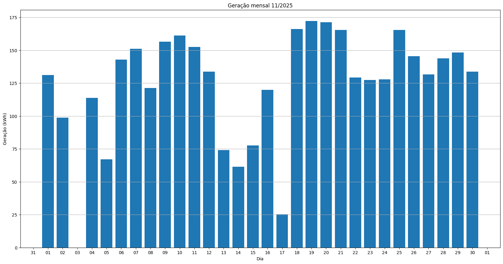
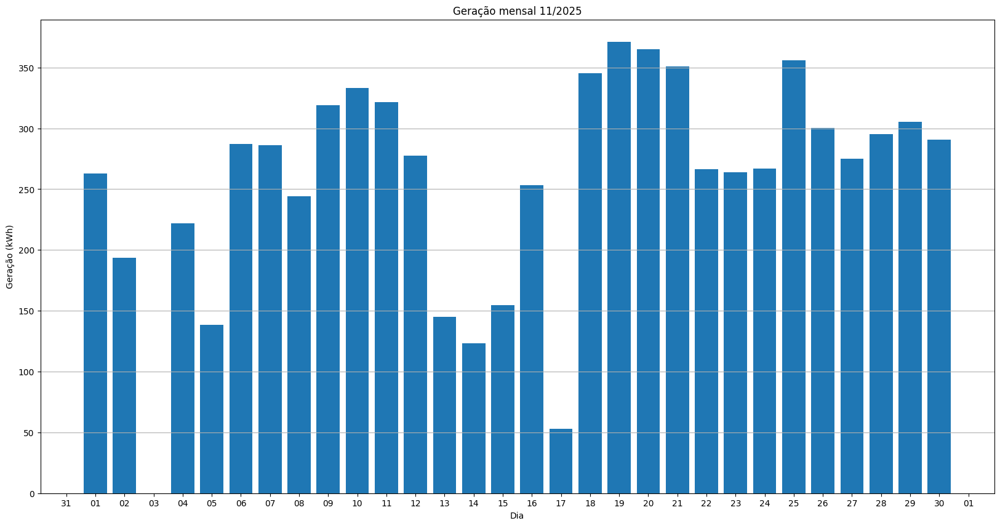
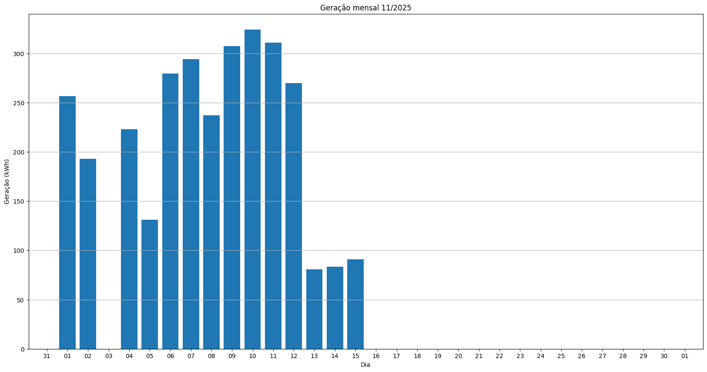
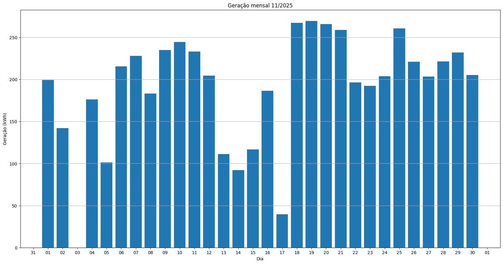
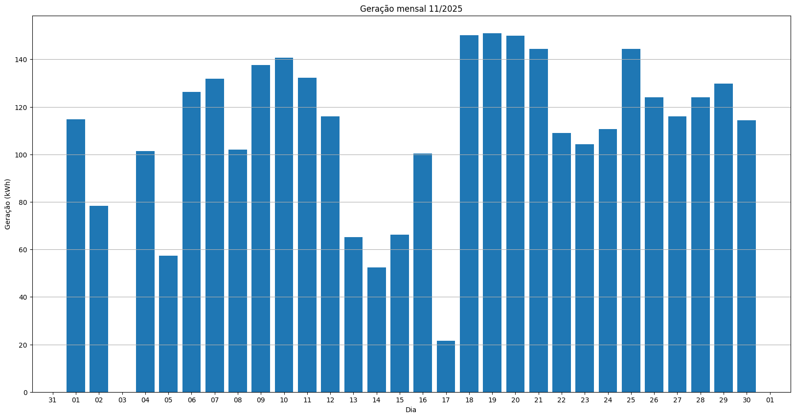
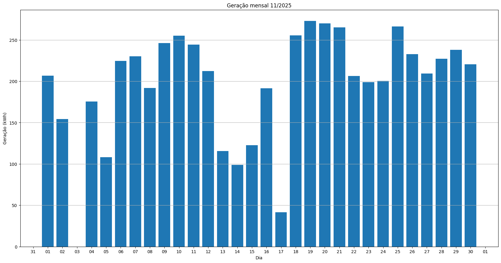

# Resumo
| Inversor | kWh    |
| -------- | ------ |
| S1_BL20_1       | 6602.00 |
| S1_BL20_2       | 6561.50 |
| S1_BL11       | 4400.60 |
| S1_BL8       | 6139.50 |
| S1_BL15       | 0.00 |
| S1_BL5       | 5681.50 |
| S1_BL7       | 6636.00 |
| S1_BL55       | 3715.20 |
| S1_BL18_1       | 7666.60 |
| S1_BL18_2       | 3081.40 |
| S1_BL19       | 7435.20 |
| S1_BL13_1       | 5705.10 |
| S1_BL13_2       | 3215.60 |
| S1_BL14       | 5882.10 |
| kWh_total       | 72722.30 |
# Geração Mensal por Inversor
## S1_BL20_1

## S1_BL20_2

## S1_BL11

## S1_BL8

## S1_BL15

## S1_BL5

## S1_BL7

## S1_BL55

## S1_BL18_1

## S1_BL18_2

## S1_BL19

## S1_BL13_1

## S1_BL13_2

## S1_BL14

