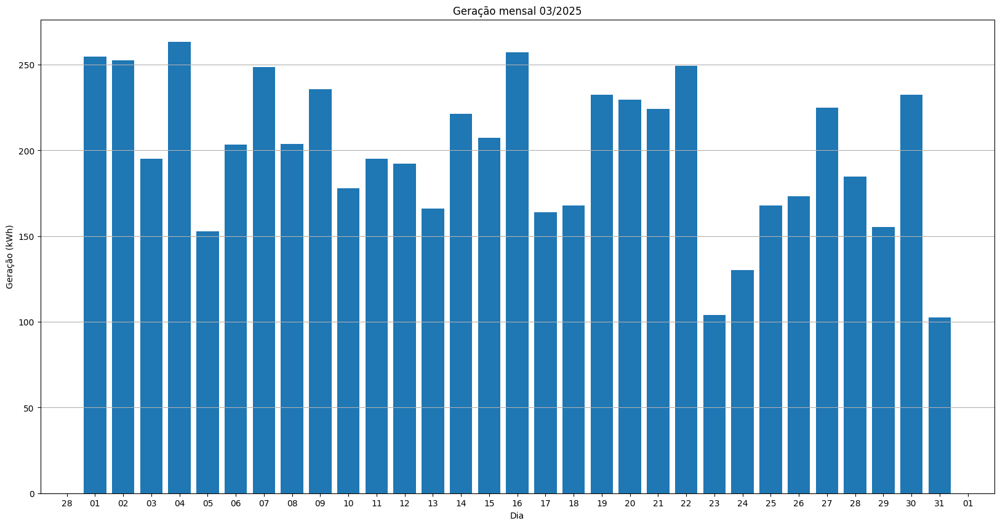
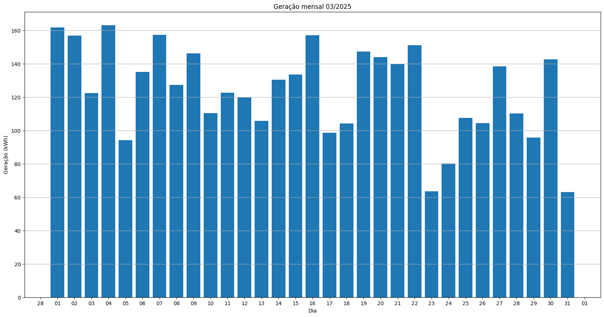
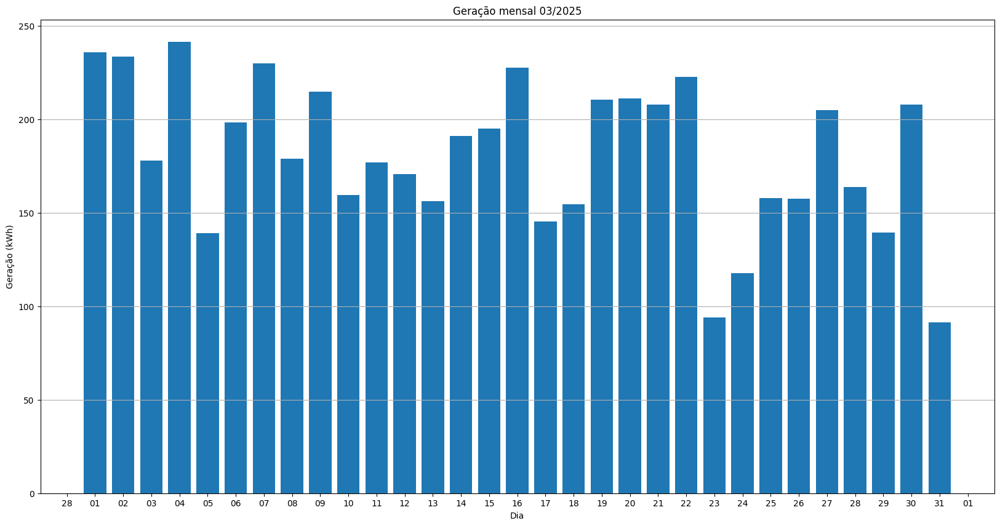
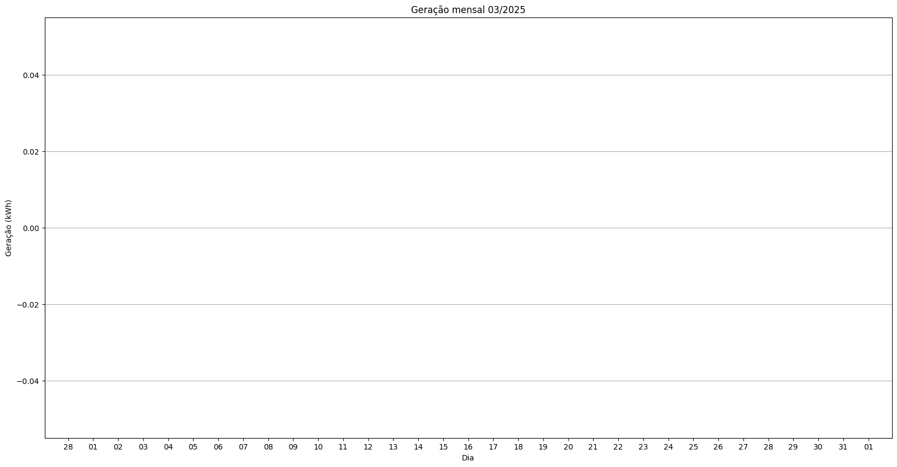
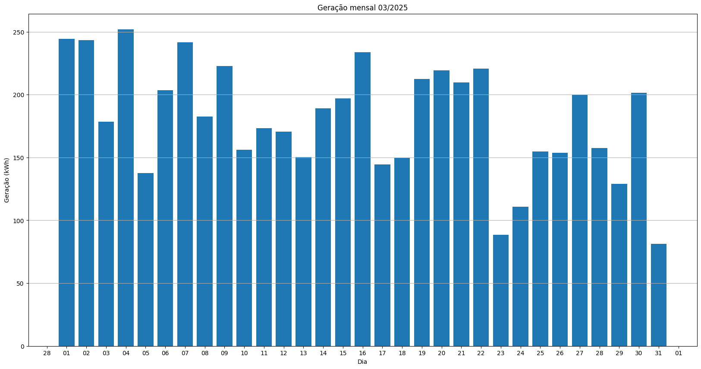
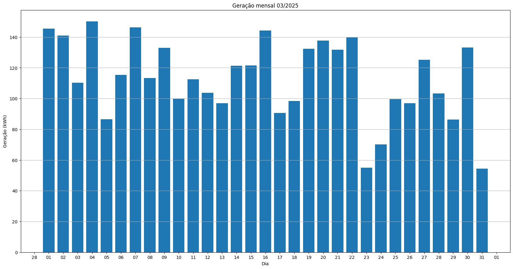
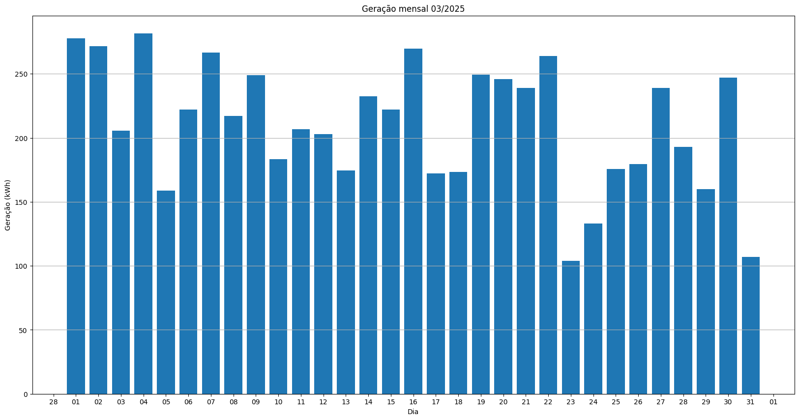
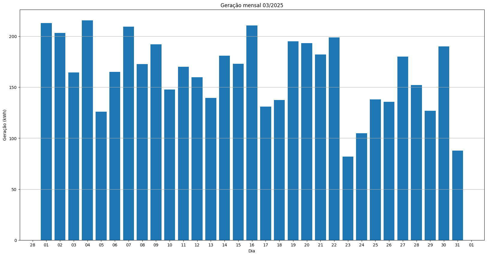
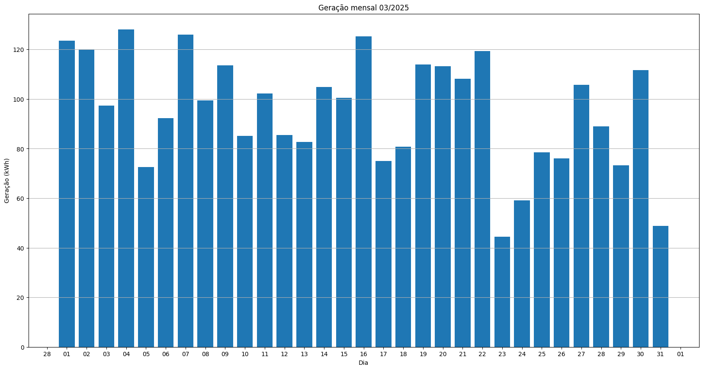

# Resumo
| Inversor | kWh    |
| -------- | ------ |
| S1_BL20_1       | 6169.50 |
| S1_BL20_2       | 5598.60 |
| S1_BL11       | 3837.00 |
| S1_BL8       | 5611.00 |
| S1_BL15       | 0.00 |
| S1_BL5       | 5265.30 |
| S1_BL7       | 5610.30 |
| S1_BL55       | 3496.40 |
| S1_BL18_1       | 0.00 |
| S1_BL18_2       | 6523.00 |
| S1_BL19       | 0.00 |
| S1_BL13_1       | 5078.10 |
| S1_BL13_2       | 2956.40 |
| S1_BL14       | 5180.80 |
| kWh_total       | 55326.40 |
# Geração Mensal por Inversor
## S1_BL20_1

## S1_BL20_2

## S1_BL11

## S1_BL8

## S1_BL15

## S1_BL5

## S1_BL7

## S1_BL55

## S1_BL18_1

## S1_BL18_2

## S1_BL19

## S1_BL13_1

## S1_BL13_2

## S1_BL14

