# Resumo
| Inversor | kWh    |
| -------- | ------ |
| S1_BL20_1       | 0.00 |
| S1_BL20_2       | 4994.20 |
| S1_BL11       | 3780.60 |
| S1_BL8       | 5518.60 |
| S1_BL15       | 0.00 |
| S1_BL5       | 4396.20 |
| S1_BL7       | 5179.00 |
| S1_BL55       | 3417.50 |
| S1_BL18_1       | 5054.80 |
| S1_BL18_2       | 0.00 |
| S1_BL19       | 6249.80 |
| S1_BL13_1       | 5102.40 |
| S1_BL13_2       | 2928.30 |
| S1_BL14       | 5158.20 |
| kWh_total       | 51779.60 |
# Geração Mensal por Inversor
## S1_BL20_1

## S1_BL20_2
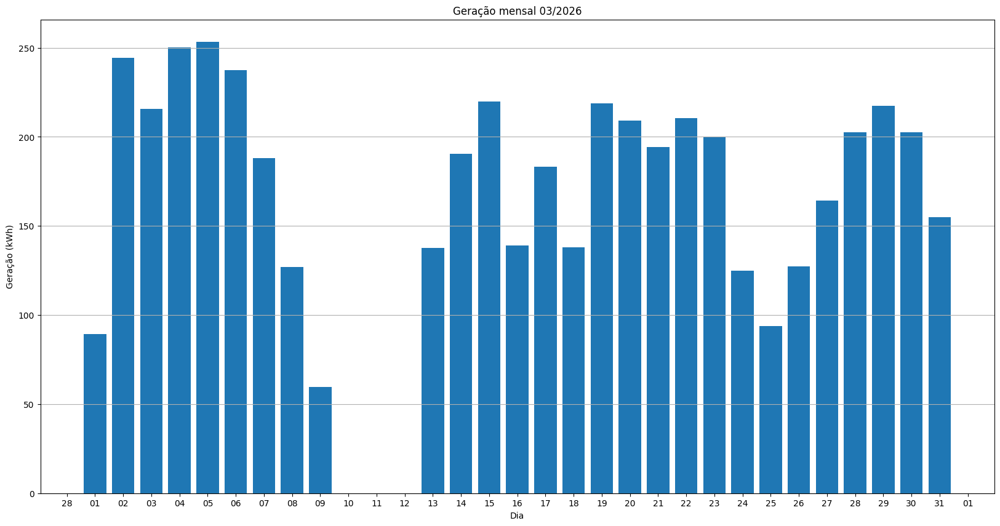
## S1_BL11
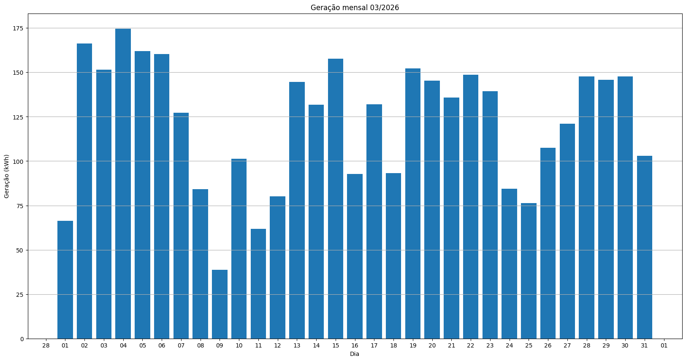
## S1_BL8
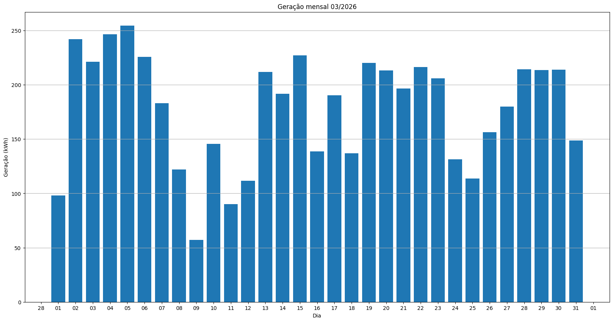
## S1_BL15

## S1_BL5
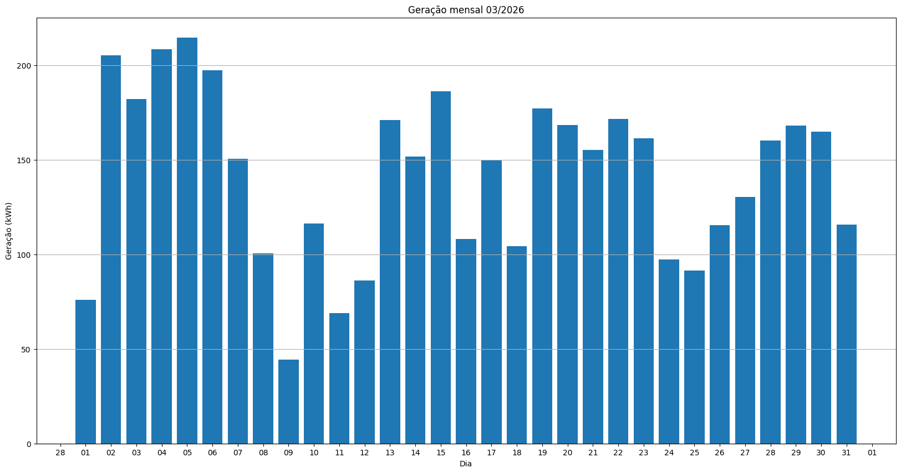
## S1_BL7
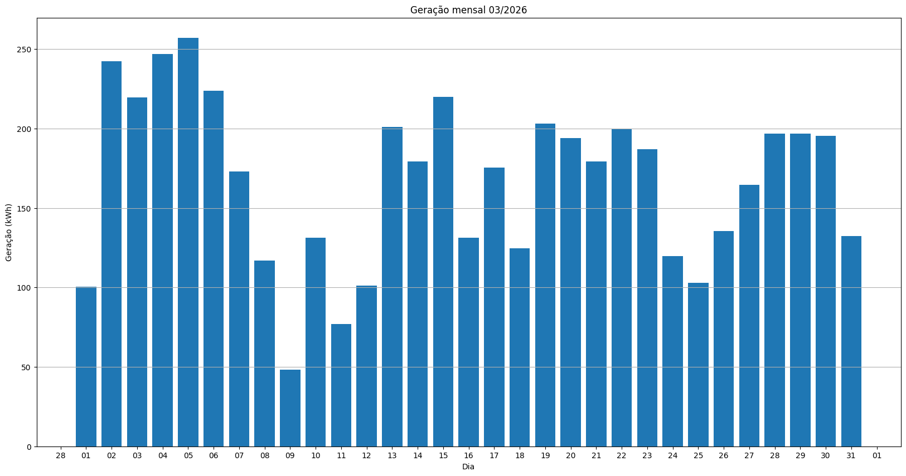
## S1_BL55
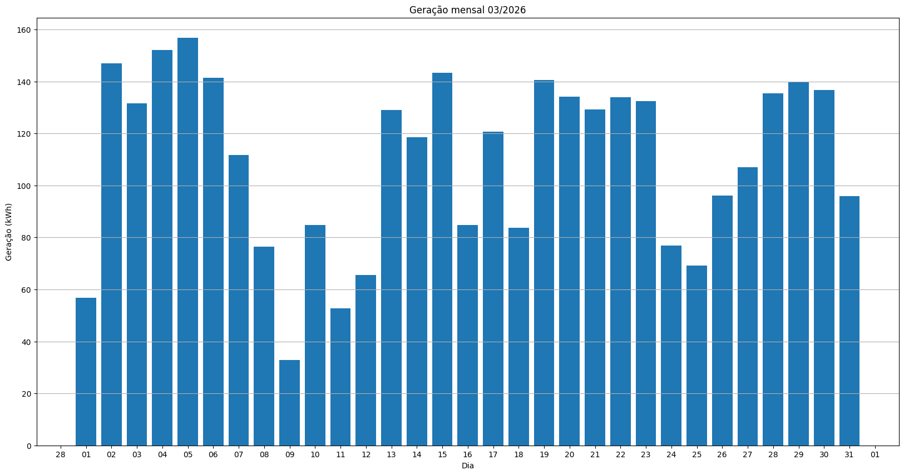
## S1_BL18_1
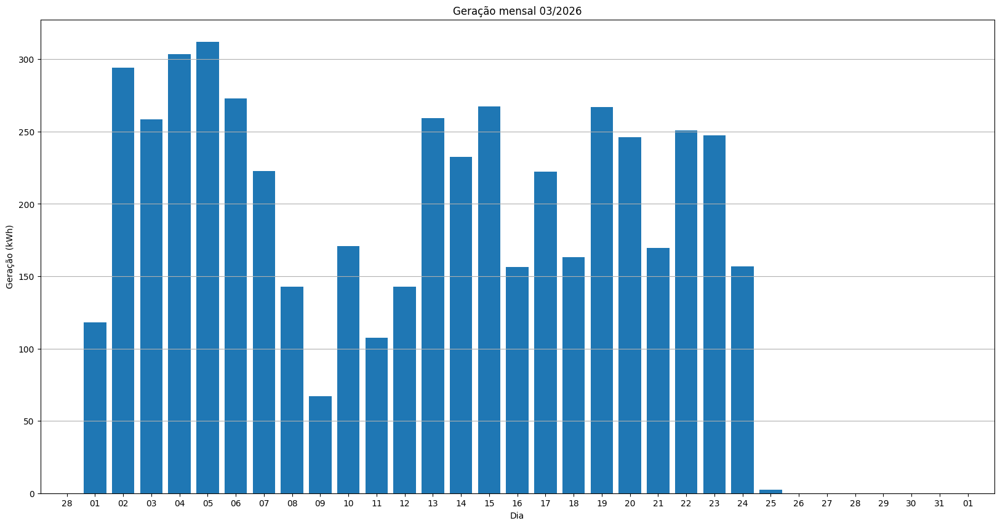
## S1_BL18_2
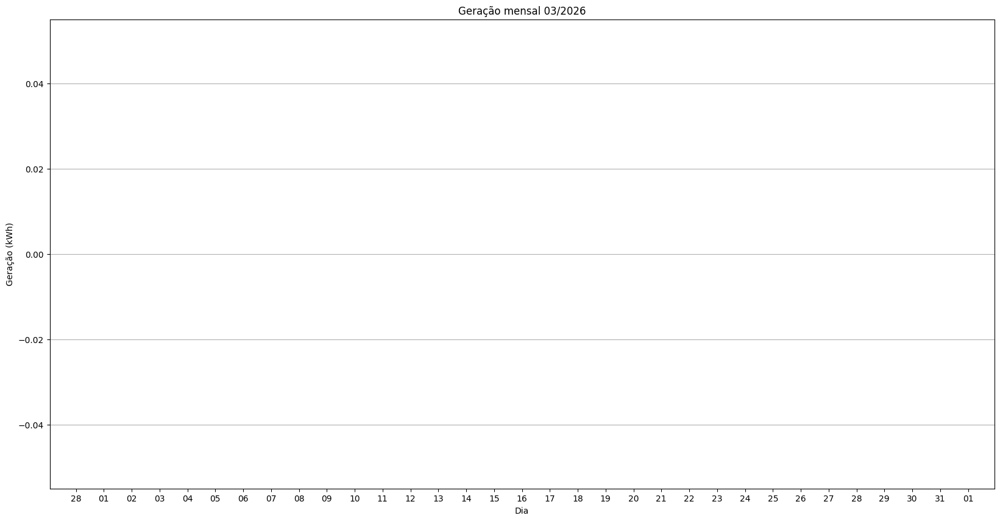
## S1_BL19
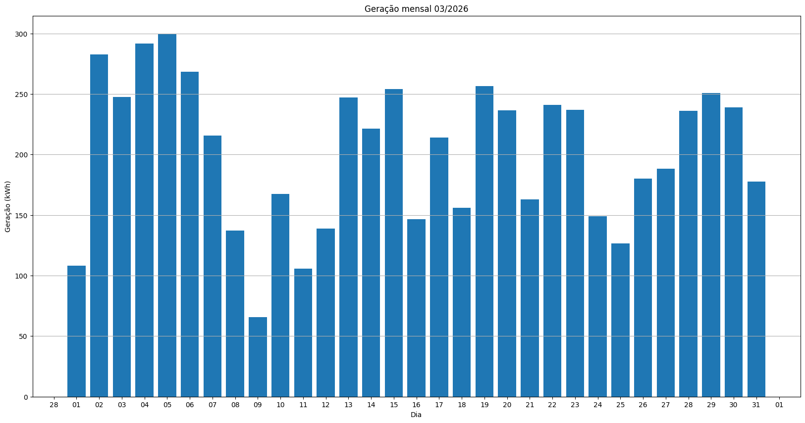
## S1_BL13_1
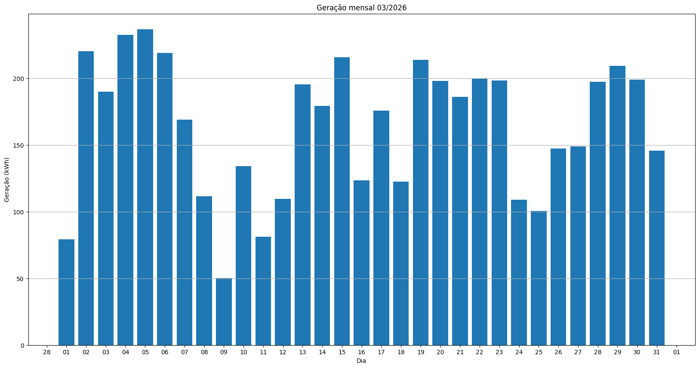
## S1_BL13_2
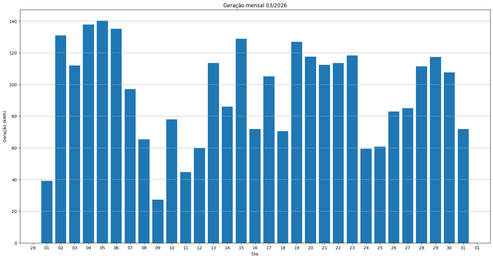
## S1_BL14
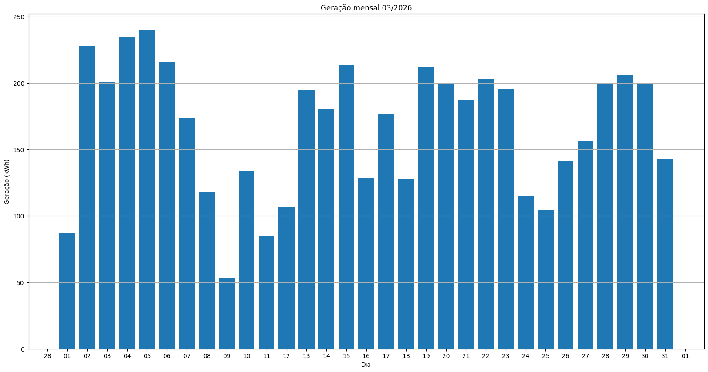
