# Resumo
| Inversor | kWh    |
| -------- | ------ |
| S1_BL20_1       | 0.00 |
| S1_BL20_2       | 4130.80 |
| S1_BL11       | 2977.70 |
| S1_BL8       | 4300.00 |
| S1_BL15       | 0.00 |
| S1_BL5       | 2634.90 |
| S1_BL7       | 2748.70 |
| S1_BL55       | 3069.10 |
| S1_BL18_1       | 0.00 |
| S1_BL18_2       | 0.00 |
| S1_BL19       | 4624.90 |
| S1_BL13_1       | 4377.90 |
| S1_BL13_2       | 2902.30 |
| S1_BL14       | 3956.90 |
| kWh_total       | 35723.20 |
# Geração Mensal por Inversor
## S1_BL20_1
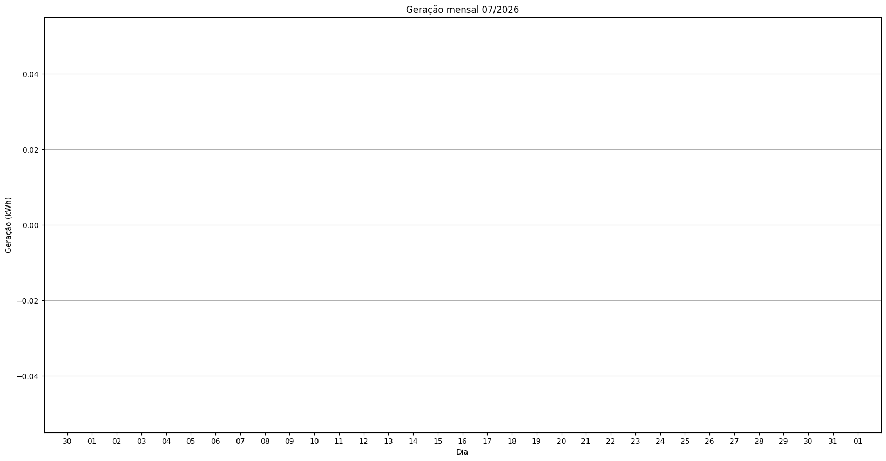
## S1_BL20_2
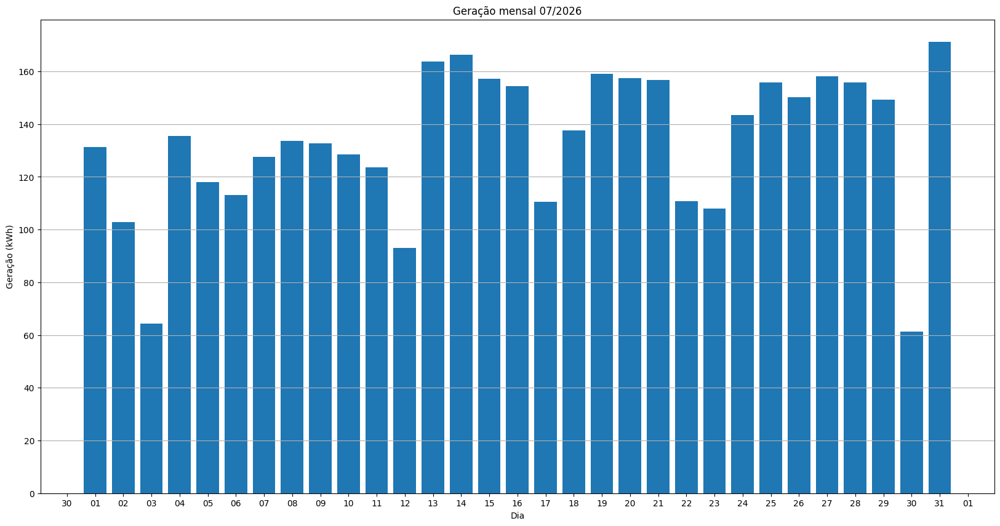
## S1_BL11
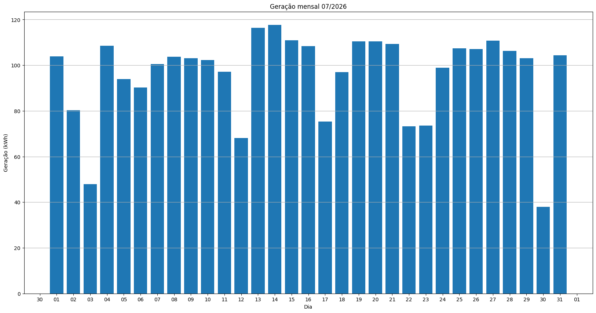
## S1_BL8
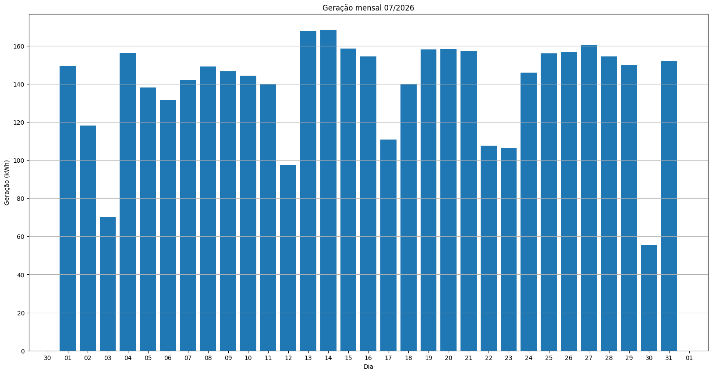
## S1_BL15

## S1_BL5
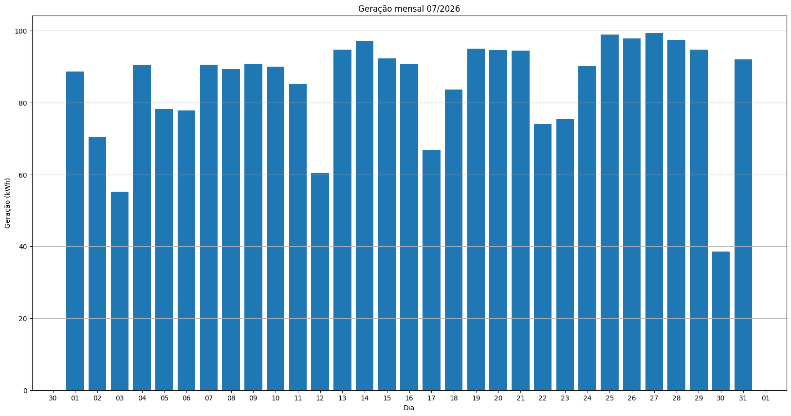
## S1_BL7
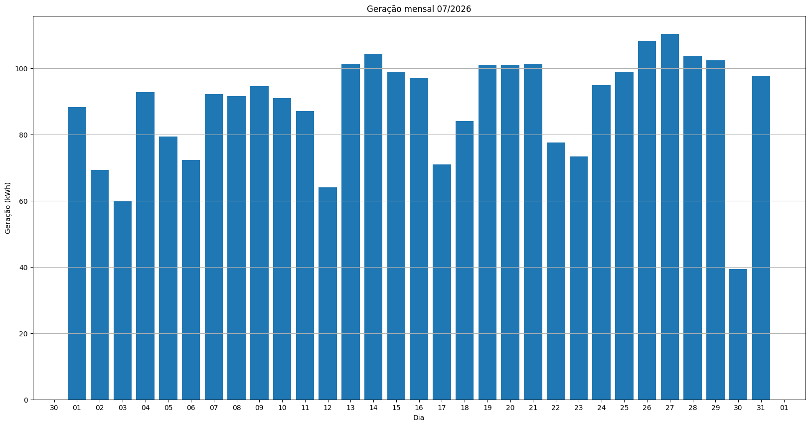
## S1_BL55
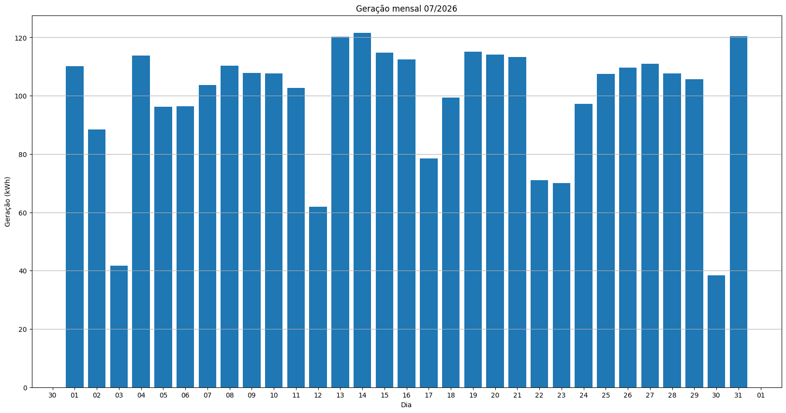
## S1_BL18_1

## S1_BL18_2

## S1_BL19
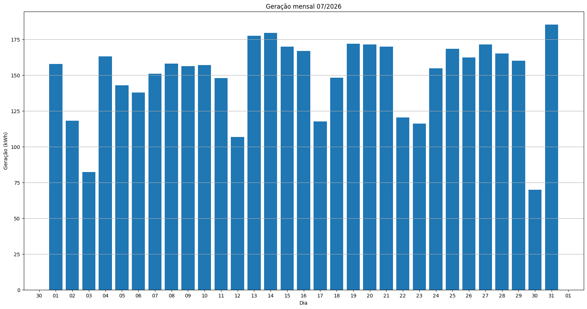
## S1_BL13_1
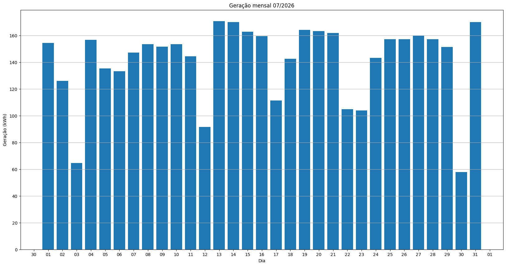
## S1_BL13_2
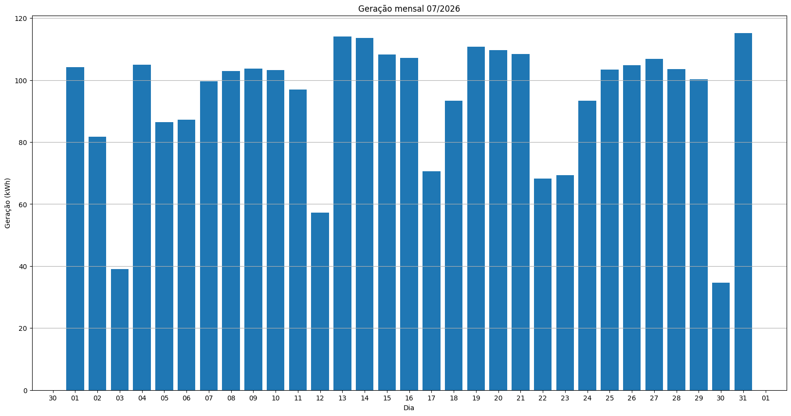
## S1_BL14
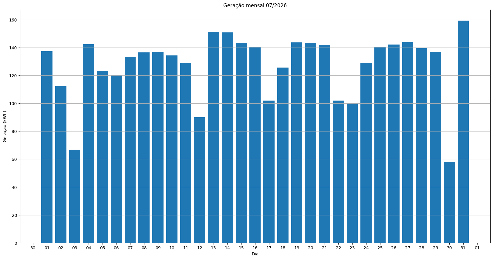
