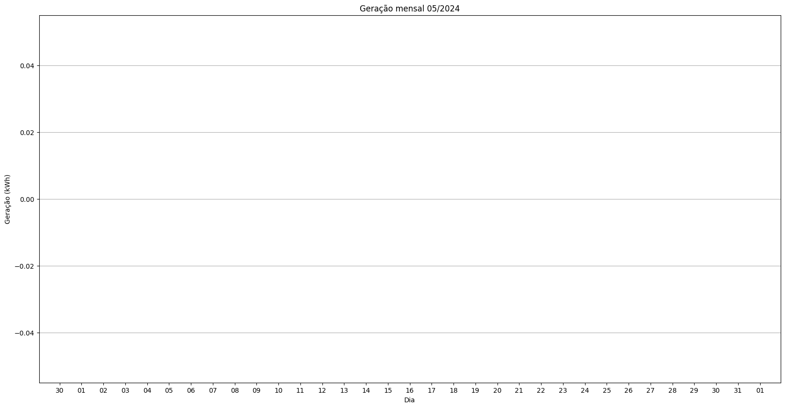
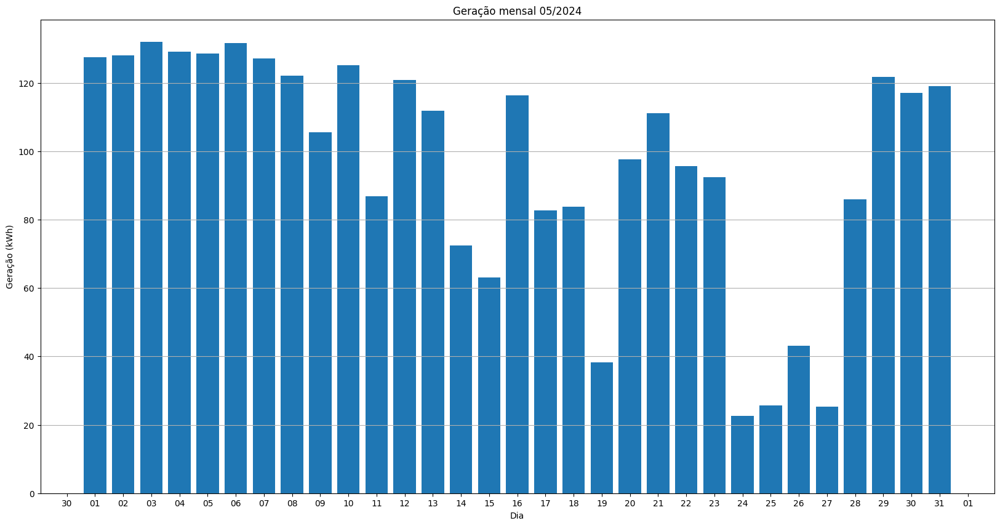
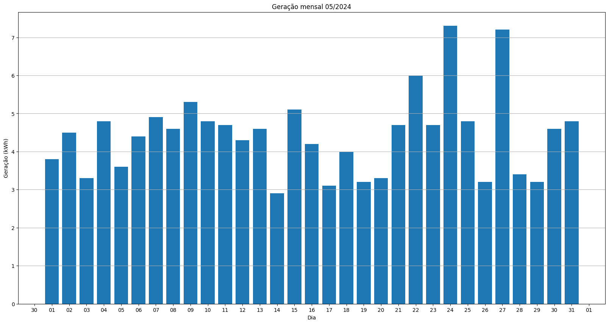
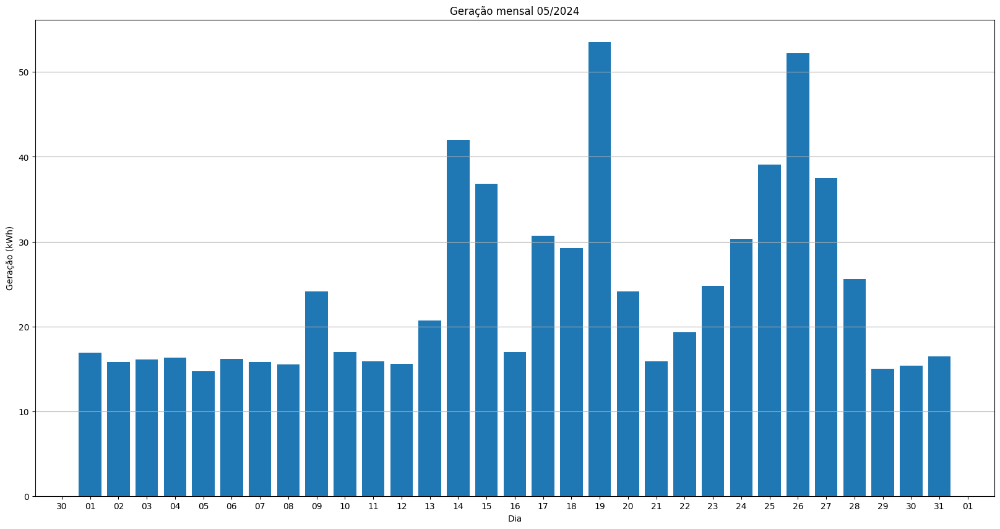
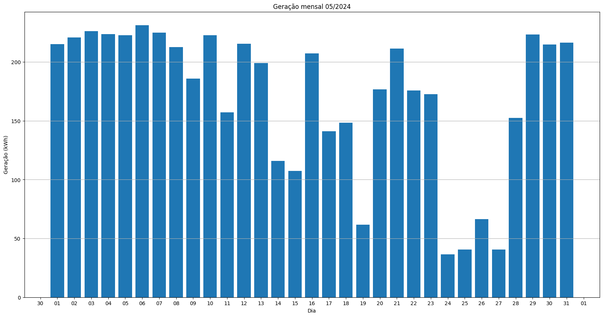

# Resumo
| Inversor | kWh    |
| -------- | ------ |
| S3_BL22       | 5657.20 |
| S3_BL23       | 0.00 |
| S3_BL24       | 2990.00 |
| S3_BL11_1       | 137.40 |
| S3_BL11_2       | 745.50 |
| S3_BL12       | 0.00 |
| S3_BL15       | 5267.50 |
| S3_BL10       | 0.00 |
| kWh_total       | 14797.60 |
# Geração Mensal por Inversor
## S3_BL22

## S3_BL23

## S3_BL24

## S3_BL11_1

## S3_BL11_2

## S3_BL12

## S3_BL15

## S3_BL10

