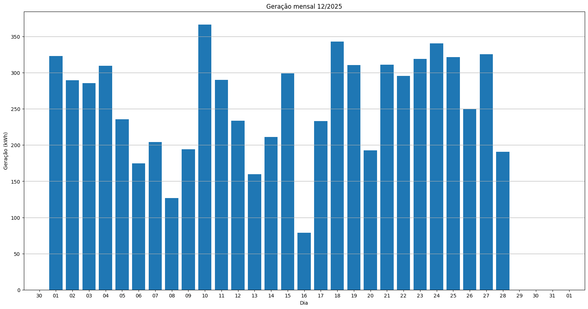
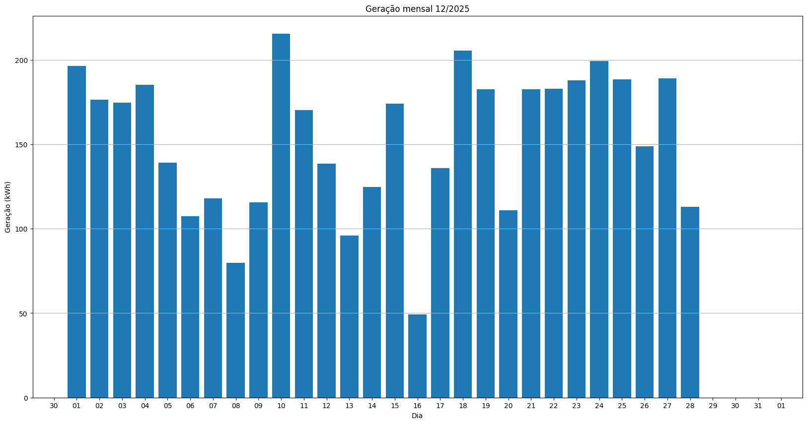
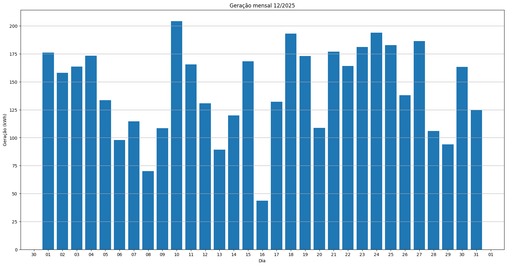
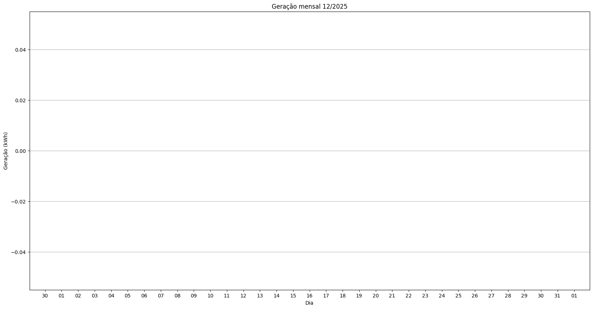
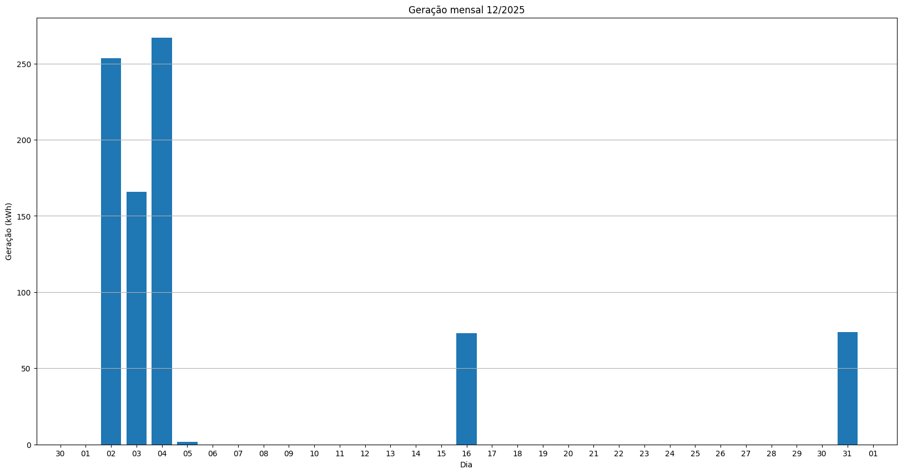
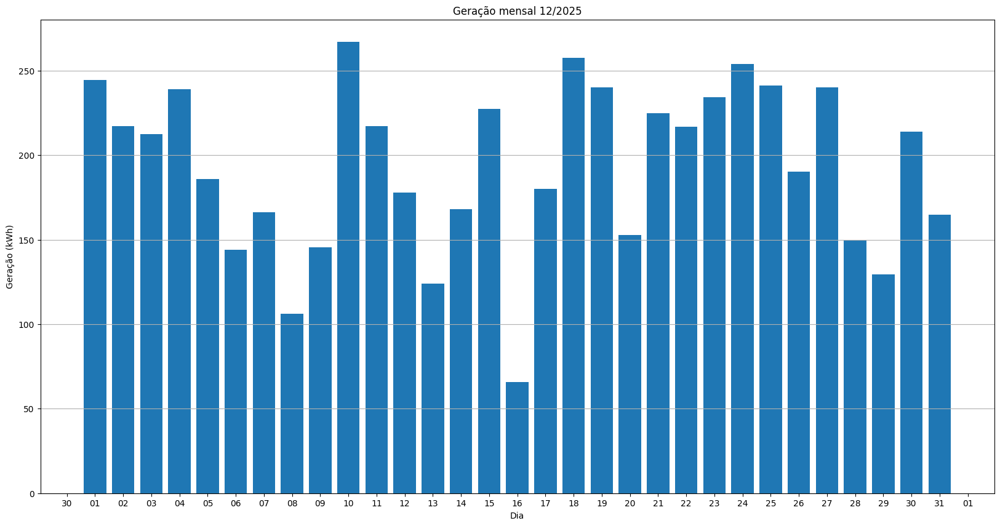

# Resumo
| Inversor | kWh    |
| -------- | ------ |
| S3_BL22       | 7216.30 |
| S3_BL23       | 4286.00 |
| S3_BL24       | 4435.70 |
| S3_BL11_1       | 0.00 |
| S3_BL11_2       | 6773.70 |
| S3_BL12       | 0.00 |
| S3_BL15       | 5997.20 |
| S3_BL10       | 6518.50 |
| kWh_total       | 35227.40 |
# Geração Mensal por Inversor
## S3_BL22

## S3_BL23

## S3_BL24

## S3_BL11_1

## S3_BL11_2

## S3_BL12

## S3_BL15

## S3_BL10

