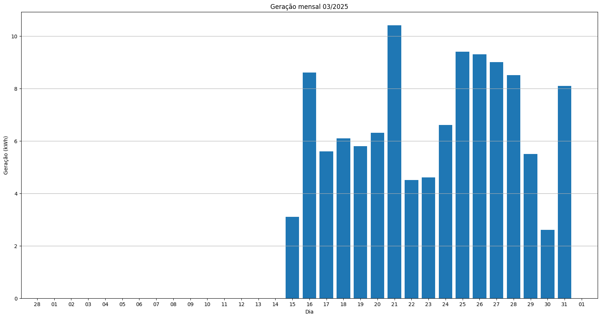

# Resumo
| Inversor | kWh    |
| -------- | ------ |
| S3_BL22       | 0.00 |
| S3_BL23       | 4354.60 |
| S3_BL24       | 3240.20 |
| S3_BL11_1       | 0.00 |
| S3_BL11_2       | 0.00 |
| S3_BL12       | 114.00 |
| S3_BL15       | 3547.00 |
| S3_BL10       | 3170.70 |
| kWh_total       | 14426.50 |
# Geração Mensal por Inversor
## S3_BL22

## S3_BL23

## S3_BL24

## S3_BL11_1

## S3_BL11_2

## S3_BL12

## S3_BL15

## S3_BL10

