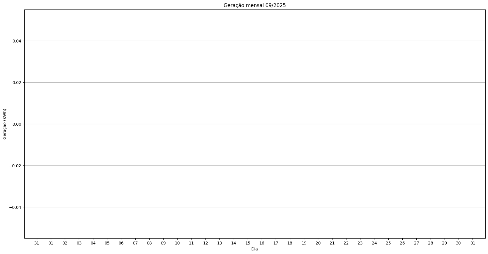
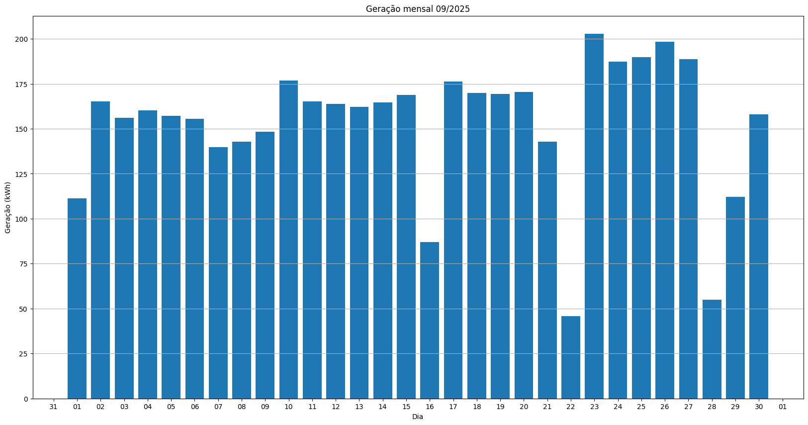
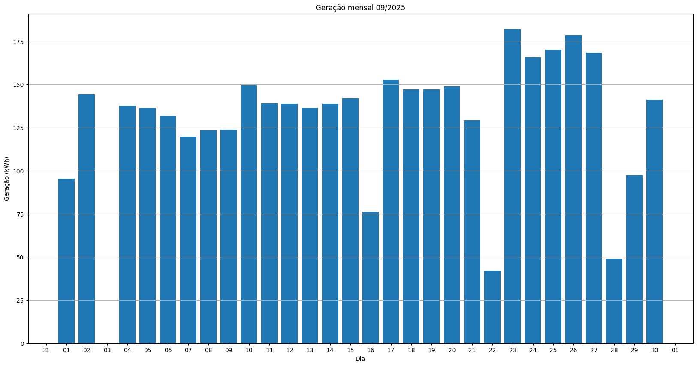
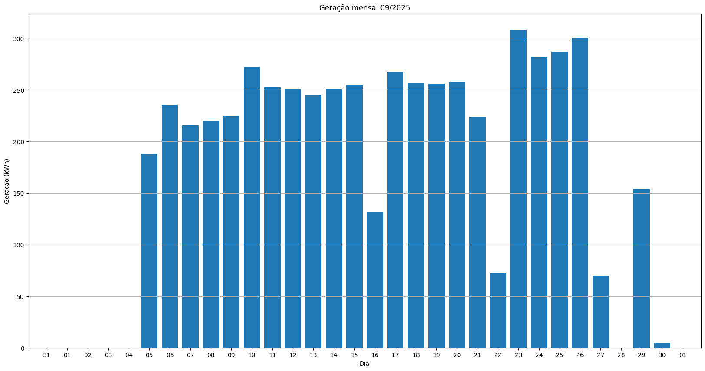
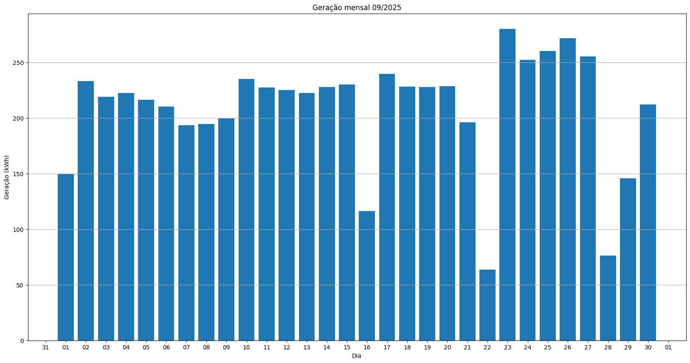

# Resumo
| Inversor | kWh    |
| -------- | ------ |
| S3_BL22       | 0.00 |
| S3_BL23       | 4591.50 |
| S3_BL24       | 3988.70 |
| S3_BL11_1       | 0.00 |
| S3_BL11_2       | 6331.20 |
| S3_BL12       | 0.00 |
| S3_BL15       | 6263.70 |
| S3_BL10       | 6578.40 |
| kWh_total       | 27753.50 |
# Geração Mensal por Inversor
## S3_BL22

## S3_BL23

## S3_BL24

## S3_BL11_1

## S3_BL11_2

## S3_BL12

## S3_BL15

## S3_BL10

